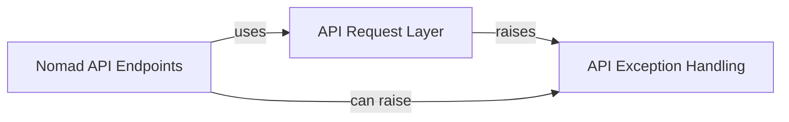

## Component Details

This graph illustrates the core components of the Nomad API client library. The `API Request Layer` serves as the fundamental communication mechanism, abstracting HTTP request complexities and handling error conditions. Various `Nomad API Endpoints` classes utilize this request layer to interact with specific Nomad API functionalities. The `API Exception Handling` component provides a structured way to manage and propagate errors encountered during API interactions, which are raised by both the `API Request Layer` and directly by the `Nomad API Endpoints`.

### API Request Layer
A foundational component that abstracts the complexities of making HTTP requests to the Nomad API. It handles URL construction, query parameter building, request execution, and robust error handling, serving as the underlying communication mechanism for all other API client modules.

**Related Classes/Methods**:

- <a href="https://github.com/jrxFive/python-nomad/blob/master/nomad/api/base.py#L10-L220" target="_blank" rel="noopener noreferrer">`nomad.api.base.Requester` (10:220)</a>
- <a href="https://github.com/jrxFive/python-nomad/blob/master/nomad/api/base.py#L17-L43" target="_blank" rel="noopener noreferrer">`nomad.api.base.Requester:__init__` (17:43)</a>
- <a href="https://github.com/jrxFive/python-nomad/blob/master/nomad/api/base.py#L103-L120" target="_blank" rel="noopener noreferrer">`nomad.api.base.Requester:request` (103:120)</a>
- <a href="https://github.com/jrxFive/python-nomad/blob/master/nomad/api/base.py#L122-L220" target="_blank" rel="noopener noreferrer">`nomad.api.base.Requester:_request` (122:220)</a>
- <a href="https://github.com/jrxFive/python-nomad/blob/master/nomad/api/base.py#L77-L84" target="_blank" rel="noopener noreferrer">`nomad.api.base.Requester:_url_builder` (77:84)</a>
- <a href="https://github.com/jrxFive/python-nomad/blob/master/nomad/api/base.py#L86-L101" target="_blank" rel="noopener noreferrer">`nomad.api.base.Requester:_query_string_builder` (86:101)</a>
- <a href="https://github.com/jrxFive/python-nomad/blob/master/nomad/api/base.py#L45-L50" target="_blank" rel="noopener noreferrer">`nomad.api.base.Requester:_endpoint_builder` (45:50)</a>
- <a href="https://github.com/jrxFive/python-nomad/blob/master/nomad/api/base.py#L52-L75" target="_blank" rel="noopener noreferrer">`nomad.api.base.Requester:_required_namespace` (52:75)</a>

### Nomad API Endpoints
This component comprises various classes that provide specific interfaces to different Nomad API functionalities, such as managing jobs, agents, nodes, deployments, and ACLs. Each class in this component utilizes the API Request Layer to perform its operations.

**Related Classes/Methods**:

- <a href="https://github.com/jrxFive/python-nomad/blob/master/nomad/api/scaling.py#L8-L74" target="_blank" rel="noopener noreferrer">`nomad.api.scaling.Scaling` (8:74)</a>
- <a href="https://github.com/jrxFive/python-nomad/blob/master/nomad/api/scaling.py#L31-L59" target="_blank" rel="noopener noreferrer">`nomad.api.scaling.Scaling:get_scaling_policies` (31:59)</a>
- <a href="https://github.com/jrxFive/python-nomad/blob/master/nomad/api/scaling.py#L61-L74" target="_blank" rel="noopener noreferrer">`nomad.api.scaling.Scaling:get_scaling_policy` (61:74)</a>
- <a href="https://github.com/jrxFive/python-nomad/blob/master/nomad/api/metrics.py#L6-L42" target="_blank" rel="noopener noreferrer">`nomad.api.metrics.Metrics` (6:42)</a>
- <a href="https://github.com/jrxFive/python-nomad/blob/master/nomad/api/metrics.py#L32-L42" target="_blank" rel="noopener noreferrer">`nomad.api.metrics.Metrics:get_metrics` (32:42)</a>
- <a href="https://github.com/jrxFive/python-nomad/blob/master/nomad/api/status.py#L30-L60" target="_blank" rel="noopener noreferrer">`nomad.api.status.Leader` (30:60)</a>
- <a href="https://github.com/jrxFive/python-nomad/blob/master/nomad/api/status.py#L50-L60" target="_blank" rel="noopener noreferrer">`nomad.api.status.Leader:get_leader` (50:60)</a>
- <a href="https://github.com/jrxFive/python-nomad/blob/master/nomad/api/status.py#L63-L108" target="_blank" rel="noopener noreferrer">`nomad.api.status.Peers` (63:108)</a>
- <a href="https://github.com/jrxFive/python-nomad/blob/master/nomad/api/status.py#L98-L108" target="_blank" rel="noopener noreferrer">`nomad.api.status.Peers:get_peers` (98:108)</a>
- <a href="https://github.com/jrxFive/python-nomad/blob/master/nomad/api/namespaces.py#L8-L75" target="_blank" rel="noopener noreferrer">`nomad.api.namespaces.Namespaces` (8:75)</a>
- <a href="https://github.com/jrxFive/python-nomad/blob/master/nomad/api/namespaces.py#L62-L75" target="_blank" rel="noopener noreferrer">`nomad.api.namespaces.Namespaces:get_namespaces` (62:75)</a>
- <a href="https://github.com/jrxFive/python-nomad/blob/master/nomad/api/jobs.py#L9-L127" target="_blank" rel="noopener noreferrer">`nomad.api.jobs.Jobs` (9:127)</a>
- <a href="https://github.com/jrxFive/python-nomad/blob/master/nomad/api/jobs.py#L67-L97" target="_blank" rel="noopener noreferrer">`nomad.api.jobs.Jobs:get_jobs` (67:97)</a>
- <a href="https://github.com/jrxFive/python-nomad/blob/master/nomad/api/jobs.py#L99-L109" target="_blank" rel="noopener noreferrer">`nomad.api.jobs.Jobs:register_job` (99:109)</a>
- <a href="https://github.com/jrxFive/python-nomad/blob/master/nomad/api/jobs.py#L111-L127" target="_blank" rel="noopener noreferrer">`nomad.api.jobs.Jobs:parse` (111:127)</a>
- <a href="https://github.com/jrxFive/python-nomad/blob/master/nomad/api/deployments.py#L8-L78" target="_blank" rel="noopener noreferrer">`nomad.api.deployments.Deployments` (8:78)</a>
- <a href="https://github.com/jrxFive/python-nomad/blob/master/nomad/api/deployments.py#L58-L78" target="_blank" rel="noopener noreferrer">`nomad.api.deployments.Deployments:get_deployments` (58:78)</a>
- <a href="https://github.com/jrxFive/python-nomad/blob/master/nomad/api/agent.py#L6-L98" target="_blank" rel="noopener noreferrer">`nomad.api.agent.Agent` (6:98)</a>
- <a href="https://github.com/jrxFive/python-nomad/blob/master/nomad/api/agent.py#L24-L34" target="_blank" rel="noopener noreferrer">`nomad.api.agent.Agent:get_agent` (24:34)</a>
- <a href="https://github.com/jrxFive/python-nomad/blob/master/nomad/api/agent.py#L36-L46" target="_blank" rel="noopener noreferrer">`nomad.api.agent.Agent:get_members` (36:46)</a>
- <a href="https://github.com/jrxFive/python-nomad/blob/master/nomad/api/agent.py#L48-L58" target="_blank" rel="noopener noreferrer">`nomad.api.agent.Agent:get_servers` (48:58)</a>
- <a href="https://github.com/jrxFive/python-nomad/blob/master/nomad/api/agent.py#L60-L71" target="_blank" rel="noopener noreferrer">`nomad.api.agent.Agent:join_agent` (60:71)</a>
- <a href="https://github.com/jrxFive/python-nomad/blob/master/nomad/api/agent.py#L73-L85" target="_blank" rel="noopener noreferrer">`nomad.api.agent.Agent:update_servers` (73:85)</a>
- <a href="https://github.com/jrxFive/python-nomad/blob/master/nomad/api/agent.py#L87-L98" target="_blank" rel="noopener noreferrer">`nomad.api.agent.Agent:force_leave` (87:98)</a>
- <a href="https://github.com/jrxFive/python-nomad/blob/master/nomad/api/node.py#L9-L193" target="_blank" rel="noopener noreferrer">`nomad.api.node.Node` (9:193)</a>
- <a href="https://github.com/jrxFive/python-nomad/blob/master/nomad/api/node.py#L52-L62" target="_blank" rel="noopener noreferrer">`nomad.api.node.Node:get_node` (52:62)</a>
- <a href="https://github.com/jrxFive/python-nomad/blob/master/nomad/api/node.py#L64-L74" target="_blank" rel="noopener noreferrer">`nomad.api.node.Node:get_allocations` (64:74)</a>
- <a href="https://github.com/jrxFive/python-nomad/blob/master/nomad/api/node.py#L76-L88" target="_blank" rel="noopener noreferrer">`nomad.api.node.Node:evaluate_node` (76:88)</a>
- <a href="https://github.com/jrxFive/python-nomad/blob/master/nomad/api/node.py#L90-L106" target="_blank" rel="noopener noreferrer">`nomad.api.node.Node:drain_node` (90:106)</a>
- <a href="https://github.com/jrxFive/python-nomad/blob/master/nomad/api/node.py#L108-L144" target="_blank" rel="noopener noreferrer">`nomad.api.node.Node:drain_node_with_spec` (108:144)</a>
- <a href="https://github.com/jrxFive/python-nomad/blob/master/nomad/api/node.py#L146-L181" target="_blank" rel="noopener noreferrer">`nomad.api.node.Node:eligible_node` (146:181)</a>
- <a href="https://github.com/jrxFive/python-nomad/blob/master/nomad/api/node.py#L183-L193" target="_blank" rel="noopener noreferrer">`nomad.api.node.Node:purge_node` (183:193)</a>
- <a href="https://github.com/jrxFive/python-nomad/blob/master/nomad/api/evaluation.py#L8-L74" target="_blank" rel="noopener noreferrer">`nomad.api.evaluation.Evaluation` (8:74)</a>
- <a href="https://github.com/jrxFive/python-nomad/blob/master/nomad/api/evaluation.py#L48-L60" target="_blank" rel="noopener noreferrer">`nomad.api.evaluation.Evaluation:get_evaluation` (48:60)</a>
- <a href="https://github.com/jrxFive/python-nomad/blob/master/nomad/api/evaluation.py#L62-L74" target="_blank" rel="noopener noreferrer">`nomad.api.evaluation.Evaluation:get_allocations` (62:74)</a>
- <a href="https://github.com/jrxFive/python-nomad/blob/master/nomad/api/job.py#L9-L363" target="_blank" rel="noopener noreferrer">`nomad.api.job.Job` (9:363)</a>
- <a href="https://github.com/jrxFive/python-nomad/blob/master/nomad/api/job.py#L51-L70" target="_blank" rel="noopener noreferrer">`nomad.api.job.Job:get_job` (51:70)</a>
- <a href="https://github.com/jrxFive/python-nomad/blob/master/nomad/api/job.py#L72-L84" target="_blank" rel="noopener noreferrer">`nomad.api.job.Job:get_versions` (72:84)</a>
- <a href="https://github.com/jrxFive/python-nomad/blob/master/nomad/api/job.py#L86-L112" target="_blank" rel="noopener noreferrer">`nomad.api.job.Job:get_allocations` (86:112)</a>
- <a href="https://github.com/jrxFive/python-nomad/blob/master/nomad/api/job.py#L114-L137" target="_blank" rel="noopener noreferrer">`nomad.api.job.Job:get_evaluations` (114:137)</a>
- <a href="https://github.com/jrxFive/python-nomad/blob/master/nomad/api/job.py#L139-L151" target="_blank" rel="noopener noreferrer">`nomad.api.job.Job:get_deployments` (139:151)</a>
- <a href="https://github.com/jrxFive/python-nomad/blob/master/nomad/api/job.py#L153-L165" target="_blank" rel="noopener noreferrer">`nomad.api.job.Job:get_deployment` (153:165)</a>
- <a href="https://github.com/jrxFive/python-nomad/blob/master/nomad/api/job.py#L167-L179" target="_blank" rel="noopener noreferrer">`nomad.api.job.Job:get_summary` (167:179)</a>
- <a href="https://github.com/jrxFive/python-nomad/blob/master/nomad/api/job.py#L181-L193" target="_blank" rel="noopener noreferrer">`nomad.api.job.Job:register_job` (181:193)</a>
- <a href="https://github.com/jrxFive/python-nomad/blob/master/nomad/api/job.py#L195-L208" target="_blank" rel="noopener noreferrer">`nomad.api.job.Job:evaluate_job` (195:208)</a>
- <a href="https://github.com/jrxFive/python-nomad/blob/master/nomad/api/job.py#L210-L229" target="_blank" rel="noopener noreferrer">`nomad.api.job.Job:plan_job` (210:229)</a>
- <a href="https://github.com/jrxFive/python-nomad/blob/master/nomad/api/job.py#L231-L246" target="_blank" rel="noopener noreferrer">`nomad.api.job.Job:periodic_job` (231:246)</a>
- <a href="https://github.com/jrxFive/python-nomad/blob/master/nomad/api/job.py#L248-L277" target="_blank" rel="noopener noreferrer">`nomad.api.job.Job:dispatch_job` (248:277)</a>
- <a href="https://github.com/jrxFive/python-nomad/blob/master/nomad/api/job.py#L279-L301" target="_blank" rel="noopener noreferrer">`nomad.api.job.Job:revert_job` (279:301)</a>
- <a href="https://github.com/jrxFive/python-nomad/blob/master/nomad/api/job.py#L303-L318" target="_blank" rel="noopener noreferrer">`nomad.api.job.Job:stable_job` (303:318)</a>
- <a href="https://github.com/jrxFive/python-nomad/blob/master/nomad/api/job.py#L320-L363" target="_blank" rel="noopener noreferrer">`nomad.api.job.Job:deregister_job` (320:363)</a>
- <a href="https://github.com/jrxFive/python-nomad/blob/master/nomad/api/system.py#L6-L52" target="_blank" rel="noopener noreferrer">`nomad.api.system.System` (6:52)</a>
- <a href="https://github.com/jrxFive/python-nomad/blob/master/nomad/api/system.py#L30-L40" target="_blank" rel="noopener noreferrer">`nomad.api.system.System:initiate_garbage_collection` (30:40)</a>
- <a href="https://github.com/jrxFive/python-nomad/blob/master/nomad/api/system.py#L42-L52" target="_blank" rel="noopener noreferrer">`nomad.api.system.System:reconcile_summaries` (42:52)</a>
- <a href="https://github.com/jrxFive/python-nomad/blob/master/nomad/api/allocations.py#L8-L83" target="_blank" rel="noopener noreferrer">`nomad.api.allocations.Allocations` (8:83)</a>
- <a href="https://github.com/jrxFive/python-nomad/blob/master/nomad/api/allocations.py#L39-L83" target="_blank" rel="noopener noreferrer">`nomad.api.allocations.Allocations:get_allocations` (39:83)</a>
- <a href="https://github.com/jrxFive/python-nomad/blob/master/nomad/api/operator.py#L6-L64" target="_blank" rel="noopener noreferrer">`nomad.api.operator.Operator` (6:64)</a>
- <a href="https://github.com/jrxFive/python-nomad/blob/master/nomad/api/operator.py#L29-L44" target="_blank" rel="noopener noreferrer">`nomad.api.operator.Operator:get_configuration` (29:44)</a>
- <a href="https://github.com/jrxFive/python-nomad/blob/master/nomad/api/operator.py#L46-L64" target="_blank" rel="noopener noreferrer">`nomad.api.operator.Operator:delete_peer` (46:64)</a>
- <a href="https://github.com/jrxFive/python-nomad/blob/master/nomad/api/variable.py#L8-L111" target="_blank" rel="noopener noreferrer">`nomad.api.variable.Variable` (8:111)</a>
- <a href="https://github.com/jrxFive/python-nomad/blob/master/nomad/api/variable.py#L42-L58" target="_blank" rel="noopener noreferrer">`nomad.api.variable.Variable:get_variable` (42:58)</a>
- <a href="https://github.com/jrxFive/python-nomad/blob/master/nomad/api/variable.py#L60-L85" target="_blank" rel="noopener noreferrer">`nomad.api.variable.Variable:create_variable` (60:85)</a>
- <a href="https://github.com/jrxFive/python-nomad/blob/master/nomad/api/variable.py#L87-L111" target="_blank" rel="noopener noreferrer">`nomad.api.variable.Variable:delete_variable` (87:111)</a>
- <a href="https://github.com/jrxFive/python-nomad/blob/master/nomad/api/namespace.py#L8-L107" target="_blank" rel="noopener noreferrer">`nomad.api.namespace.Namespace` (8:107)</a>
- <a href="https://github.com/jrxFive/python-nomad/blob/master/nomad/api/namespace.py#L51-L63" target="_blank" rel="noopener noreferrer">`nomad.api.namespace.Namespace:get_namespace` (51:63)</a>
- <a href="https://github.com/jrxFive/python-nomad/blob/master/nomad/api/namespace.py#L65-L78" target="_blank" rel="noopener noreferrer">`nomad.api.namespace.Namespace:create_namespace` (65:78)</a>
- <a href="https://github.com/jrxFive/python-nomad/blob/master/nomad/api/namespace.py#L80-L93" target="_blank" rel="noopener noreferrer">`nomad.api.namespace.Namespace:update_namespace` (80:93)</a>
- <a href="https://github.com/jrxFive/python-nomad/blob/master/nomad/api/namespace.py#L95-L107" target="_blank" rel="noopener noreferrer">`nomad.api.namespace.Namespace:delete_namespace` (95:107)</a>
- <a href="https://github.com/jrxFive/python-nomad/blob/master/nomad/api/sentinel.py#L6-L98" target="_blank" rel="noopener noreferrer">`nomad.api.sentinel.Sentinel` (6:98)</a>
- <a href="https://github.com/jrxFive/python-nomad/blob/master/nomad/api/sentinel.py#L28-L39" target="_blank" rel="noopener noreferrer">`nomad.api.sentinel.Sentinel:get_policies` (28:39)</a>
- <a href="https://github.com/jrxFive/python-nomad/blob/master/nomad/api/sentinel.py#L41-L54" target="_blank" rel="noopener noreferrer">`nomad.api.sentinel.Sentinel:create_policy` (41:54)</a>
- <a href="https://github.com/jrxFive/python-nomad/blob/master/nomad/api/sentinel.py#L56-L67" target="_blank" rel="noopener noreferrer">`nomad.api.sentinel.Sentinel:get_policy` (56:67)</a>
- <a href="https://github.com/jrxFive/python-nomad/blob/master/nomad/api/sentinel.py#L69-L83" target="_blank" rel="noopener noreferrer">`nomad.api.sentinel.Sentinel:update_policy` (69:83)</a>
- <a href="https://github.com/jrxFive/python-nomad/blob/master/nomad/api/sentinel.py#L85-L98" target="_blank" rel="noopener noreferrer">`nomad.api.sentinel.Sentinel:delete_policy` (85:98)</a>
- <a href="https://github.com/jrxFive/python-nomad/blob/master/nomad/api/client.py#L35-L65" target="_blank" rel="noopener noreferrer">`nomad.api.client.ls` (35:65)</a>
- <a href="https://github.com/jrxFive/python-nomad/blob/master/nomad/api/client.py#L49-L65" target="_blank" rel="noopener noreferrer">`nomad.api.client.ls:list_files` (49:65)</a>
- <a href="https://github.com/jrxFive/python-nomad/blob/master/nomad/api/client.py#L68-L99" target="_blank" rel="noopener noreferrer">`nomad.api.client.cat` (68:99)</a>
- <a href="https://github.com/jrxFive/python-nomad/blob/master/nomad/api/client.py#L83-L99" target="_blank" rel="noopener noreferrer">`nomad.api.client.cat:read_file` (83:99)</a>
- <a href="https://github.com/jrxFive/python-nomad/blob/master/nomad/api/client.py#L102-L130" target="_blank" rel="noopener noreferrer">`nomad.api.client.read_at` (102:130)</a>
- <a href="https://github.com/jrxFive/python-nomad/blob/master/nomad/api/client.py#L114-L130" target="_blank" rel="noopener noreferrer">`nomad.api.client.read_at:read_file_offset` (114:130)</a>
- <a href="https://github.com/jrxFive/python-nomad/blob/master/nomad/api/client.py#L133-L161" target="_blank" rel="noopener noreferrer">`nomad.api.client.stream_file` (133:161)</a>
- <a href="https://github.com/jrxFive/python-nomad/blob/master/nomad/api/client.py#L145-L161" target="_blank" rel="noopener noreferrer">`nomad.api.client.stream_file:stream` (145:161)</a>
- <a href="https://github.com/jrxFive/python-nomad/blob/master/nomad/api/client.py#L164-L202" target="_blank" rel="noopener noreferrer">`nomad.api.client.stream_logs` (164:202)</a>
- <a href="https://github.com/jrxFive/python-nomad/blob/master/nomad/api/client.py#L176-L202" target="_blank" rel="noopener noreferrer">`nomad.api.client.stream_logs:stream` (176:202)</a>
- <a href="https://github.com/jrxFive/python-nomad/blob/master/nomad/api/client.py#L205-L235" target="_blank" rel="noopener noreferrer">`nomad.api.client.stat` (205:235)</a>
- <a href="https://github.com/jrxFive/python-nomad/blob/master/nomad/api/client.py#L219-L235" target="_blank" rel="noopener noreferrer">`nomad.api.client.stat:stat_file` (219:235)</a>
- <a href="https://github.com/jrxFive/python-nomad/blob/master/nomad/api/client.py#L238-L264" target="_blank" rel="noopener noreferrer">`nomad.api.client.stats` (238:264)</a>
- <a href="https://github.com/jrxFive/python-nomad/blob/master/nomad/api/client.py#L252-L264" target="_blank" rel="noopener noreferrer">`nomad.api.client.stats:read_stats` (252:264)</a>
- <a href="https://github.com/jrxFive/python-nomad/blob/master/nomad/api/client.py#L267-L321" target="_blank" rel="noopener noreferrer">`nomad.api.client.allocation` (267:321)</a>
- <a href="https://github.com/jrxFive/python-nomad/blob/master/nomad/api/client.py#L282-L293" target="_blank" rel="noopener noreferrer">`nomad.api.client.allocation:read_allocation_stats` (282:293)</a>
- <a href="https://github.com/jrxFive/python-nomad/blob/master/nomad/api/client.py#L295-L305" target="_blank" rel="noopener noreferrer">`nomad.api.client.allocation:restart_allocation` (295:305)</a>
- <a href="https://github.com/jrxFive/python-nomad/blob/master/nomad/api/client.py#L307-L321" target="_blank" rel="noopener noreferrer">`nomad.api.client.allocation:signal_allocation` (307:321)</a>
- <a href="https://github.com/jrxFive/python-nomad/blob/master/nomad/api/client.py#L324-L347" target="_blank" rel="noopener noreferrer">`nomad.api.client.gc_allocation` (324:347)</a>
- <a href="https://github.com/jrxFive/python-nomad/blob/master/nomad/api/client.py#L336-L347" target="_blank" rel="noopener noreferrer">`nomad.api.client.gc_allocation:garbage_collect` (336:347)</a>
- <a href="https://github.com/jrxFive/python-nomad/blob/master/nomad/api/client.py#L350-L372" target="_blank" rel="noopener noreferrer">`nomad.api.client.gc_all_allocations` (350:372)</a>
- <a href="https://github.com/jrxFive/python-nomad/blob/master/nomad/api/client.py#L362-L372" target="_blank" rel="noopener noreferrer">`nomad.api.client.gc_all_allocations:garbage_collect` (362:372)</a>
- <a href="https://github.com/jrxFive/python-nomad/blob/master/nomad/api/regions.py#L8-L68" target="_blank" rel="noopener noreferrer">`nomad.api.regions.Regions` (8:68)</a>
- <a href="https://github.com/jrxFive/python-nomad/blob/master/nomad/api/regions.py#L58-L68" target="_blank" rel="noopener noreferrer">`nomad.api.regions.Regions:get_regions` (58:68)</a>
- <a href="https://github.com/jrxFive/python-nomad/blob/master/nomad/api/validate.py#L6-L44" target="_blank" rel="noopener noreferrer">`nomad.api.validate.Validate` (6:44)</a>
- <a href="https://github.com/jrxFive/python-nomad/blob/master/nomad/api/validate.py#L30-L44" target="_blank" rel="noopener noreferrer">`nomad.api.validate.Validate:validate_job` (30:44)</a>
- <a href="https://github.com/jrxFive/python-nomad/blob/master/nomad/api/acl.py#L6-L194" target="_blank" rel="noopener noreferrer">`nomad.api.acl.Acl` (6:194)</a>
- <a href="https://github.com/jrxFive/python-nomad/blob/master/nomad/api/acl.py#L27-L38" target="_blank" rel="noopener noreferrer">`nomad.api.acl.Acl:generate_bootstrap` (27:38)</a>
- <a href="https://github.com/jrxFive/python-nomad/blob/master/nomad/api/acl.py#L40-L52" target="_blank" rel="noopener noreferrer">`nomad.api.acl.Acl:get_tokens` (40:52)</a>
- <a href="https://github.com/jrxFive/python-nomad/blob/master/nomad/api/acl.py#L54-L65" target="_blank" rel="noopener noreferrer">`nomad.api.acl.Acl:get_token` (54:65)</a>
- <a href="https://github.com/jrxFive/python-nomad/blob/master/nomad/api/acl.py#L67-L78" target="_blank" rel="noopener noreferrer">`nomad.api.acl.Acl:get_self_token` (67:78)</a>
- <a href="https://github.com/jrxFive/python-nomad/blob/master/nomad/api/acl.py#L80-L93" target="_blank" rel="noopener noreferrer">`nomad.api.acl.Acl:create_token` (80:93)</a>
- <a href="https://github.com/jrxFive/python-nomad/blob/master/nomad/api/acl.py#L95-L106" target="_blank" rel="noopener noreferrer">`nomad.api.acl.Acl:delete_token` (95:106)</a>
- <a href="https://github.com/jrxFive/python-nomad/blob/master/nomad/api/acl.py#L108-L122" target="_blank" rel="noopener noreferrer">`nomad.api.acl.Acl:update_token` (108:122)</a>
- <a href="https://github.com/jrxFive/python-nomad/blob/master/nomad/api/acl.py#L124-L135" target="_blank" rel="noopener noreferrer">`nomad.api.acl.Acl:get_policies` (124:135)</a>
- <a href="https://github.com/jrxFive/python-nomad/blob/master/nomad/api/acl.py#L137-L150" target="_blank" rel="noopener noreferrer">`nomad.api.acl.Acl:create_policy` (137:150)</a>
- <a href="https://github.com/jrxFive/python-nomad/blob/master/nomad/api/acl.py#L152-L163" target="_blank" rel="noopener noreferrer">`nomad.api.acl.Acl:get_policy` (152:163)</a>
- <a href="https://github.com/jrxFive/python-nomad/blob/master/nomad/api/acl.py#L165-L179" target="_blank" rel="noopener noreferrer">`nomad.api.acl.Acl:update_policy` (165:179)</a>
- <a href="https://github.com/jrxFive/python-nomad/blob/master/nomad/api/acl.py#L181-L194" target="_blank" rel="noopener noreferrer">`nomad.api.acl.Acl:delete_policy` (181:194)</a>
- <a href="https://github.com/jrxFive/python-nomad/blob/master/nomad/api/nodes.py#L10-L95" target="_blank" rel="noopener noreferrer">`nomad.api.nodes.Nodes` (10:95)</a>
- <a href="https://github.com/jrxFive/python-nomad/blob/master/nomad/api/nodes.py#L67-L95" target="_blank" rel="noopener noreferrer">`nomad.api.nodes.Nodes:get_nodes` (67:95)</a>
- <a href="https://github.com/jrxFive/python-nomad/blob/master/nomad/api/deployment.py#L8-L172" target="_blank" rel="noopener noreferrer">`nomad.api.deployment.Deployment` (8:172)</a>
- <a href="https://github.com/jrxFive/python-nomad/blob/master/nomad/api/deployment.py#L46-L58" target="_blank" rel="noopener noreferrer">`nomad.api.deployment.Deployment:get_deployment` (46:58)</a>
- <a href="https://github.com/jrxFive/python-nomad/blob/master/nomad/api/deployment.py#L60-L72" target="_blank" rel="noopener noreferrer">`nomad.api.deployment.Deployment:get_deployment_allocations` (60:72)</a>
- <a href="https://github.com/jrxFive/python-nomad/blob/master/nomad/api/deployment.py#L74-L88" target="_blank" rel="noopener noreferrer">`nomad.api.deployment.Deployment:fail_deployment` (74:88)</a>
- <a href="https://github.com/jrxFive/python-nomad/blob/master/nomad/api/deployment.py#L90-L105" target="_blank" rel="noopener noreferrer">`nomad.api.deployment.Deployment:pause_deployment` (90:105)</a>
- <a href="https://github.com/jrxFive/python-nomad/blob/master/nomad/api/deployment.py#L107-L122" target="_blank" rel="noopener noreferrer">`nomad.api.deployment.Deployment:promote_deployment_all` (107:122)</a>
- <a href="https://github.com/jrxFive/python-nomad/blob/master/nomad/api/deployment.py#L124-L141" target="_blank" rel="noopener noreferrer">`nomad.api.deployment.Deployment:promote_deployment_groups` (124:141)</a>
- <a href="https://github.com/jrxFive/python-nomad/blob/master/nomad/api/deployment.py#L143-L172" target="_blank" rel="noopener noreferrer">`nomad.api.deployment.Deployment:deployment_allocation_health` (143:172)</a>
- <a href="https://github.com/jrxFive/python-nomad/blob/master/nomad/api/variables.py#L6-L66" target="_blank" rel="noopener noreferrer">`nomad.api.variables.Variables` (6:66)</a>
- <a href="https://github.com/jrxFive/python-nomad/blob/master/nomad/api/variables.py#L47-L66" target="_blank" rel="noopener noreferrer">`nomad.api.variables.Variables:get_variables` (47:66)</a>
- <a href="https://github.com/jrxFive/python-nomad/blob/master/nomad/api/evaluations.py#L8-L75" target="_blank" rel="noopener noreferrer">`nomad.api.evaluations.Evaluations` (8:75)</a>
- <a href="https://github.com/jrxFive/python-nomad/blob/master/nomad/api/evaluations.py#L62-L75" target="_blank" rel="noopener noreferrer">`nomad.api.evaluations.Evaluations:get_evaluations` (62:75)</a>
- <a href="https://github.com/jrxFive/python-nomad/blob/master/nomad/api/search.py#L8-L98" target="_blank" rel="noopener noreferrer">`nomad.api.search.Search` (8:98)</a>
- <a href="https://github.com/jrxFive/python-nomad/blob/master/nomad/api/search.py#L33-L66" target="_blank" rel="noopener noreferrer">`nomad.api.search.Search:search` (33:66)</a>
- <a href="https://github.com/jrxFive/python-nomad/blob/master/nomad/api/search.py#L68-L98" target="_blank" rel="noopener noreferrer">`nomad.api.search.Search:fuzzy_search` (68:98)</a>
- <a href="https://github.com/jrxFive/python-nomad/blob/master/nomad/api/allocation.py#L8-L73" target="_blank" rel="noopener noreferrer">`nomad.api.allocation.Allocation` (8:73)</a>
- <a href="https://github.com/jrxFive/python-nomad/blob/master/nomad/api/allocation.py#L51-L61" target="_blank" rel="noopener noreferrer">`nomad.api.allocation.Allocation:get_allocation` (51:61)</a>
- <a href="https://github.com/jrxFive/python-nomad/blob/master/nomad/api/allocation.py#L63-L73" target="_blank" rel="noopener noreferrer">`nomad.api.allocation.Allocation:stop_allocation` (63:73)</a>
- <a href="https://github.com/jrxFive/python-nomad/blob/master/nomad/api/event.py#L31-L133" target="_blank" rel="noopener noreferrer">`nomad.api.event.stream` (31:133)</a>
- <a href="https://github.com/jrxFive/python-nomad/blob/master/nomad/api/event.py#L43-L68" target="_blank" rel="noopener noreferrer">`nomad.api.event.stream:_get_stream` (43:68)</a>

### API Exception Handling
This component defines and manages custom exceptions that can occur during interactions with the Nomad API. These exceptions provide specific error contexts for different types of API failures.

**Related Classes/Methods**:

- <a href="https://github.com/jrxFive/python-nomad/blob/master/nomad/api/exceptions.py#L35-L36" target="_blank" rel="noopener noreferrer">`nomad.api.exceptions.InvalidParameters` (35:36)</a>
- <a href="https://github.com/jrxFive/python-nomad/blob/master/nomad/api/exceptions.py#L27-L28" target="_blank" rel="noopener noreferrer">`nomad.api.exceptions.BadRequestNomadException` (27:28)</a>
- <a href="https://github.com/jrxFive/python-nomad/blob/master/nomad/api/exceptions.py#L23-L24" target="_blank" rel="noopener noreferrer">`nomad.api.exceptions.URLNotAuthorizedNomadException` (23:24)</a>
- <a href="https://github.com/jrxFive/python-nomad/blob/master/nomad/api/exceptions.py#L19-L20" target="_blank" rel="noopener noreferrer">`nomad.api.exceptions.URLNotFoundNomadException` (19:20)</a>
- <a href="https://github.com/jrxFive/python-nomad/blob/master/nomad/api/exceptions.py#L31-L32" target="_blank" rel="noopener noreferrer">`nomad.api.exceptions.VariableConflict` (31:32)</a>
- <a href="https://github.com/jrxFive/python-nomad/blob/master/nomad/api/exceptions.py#L6-L16" target="_blank" rel="noopener noreferrer">`nomad.api.exceptions.BaseNomadException` (6:16)</a>
- <a href="https://github.com/jrxFive/python-nomad/blob/master/nomad/api/exceptions.py#L39-L40" target="_blank" rel="noopener noreferrer">`nomad.api.exceptions.TimeoutNomadException` (39:40)</a>

### [FAQ](https://github.com/CodeBoarding/GeneratedOnBoardings/tree/main?tab=readme-ov-file#faq)