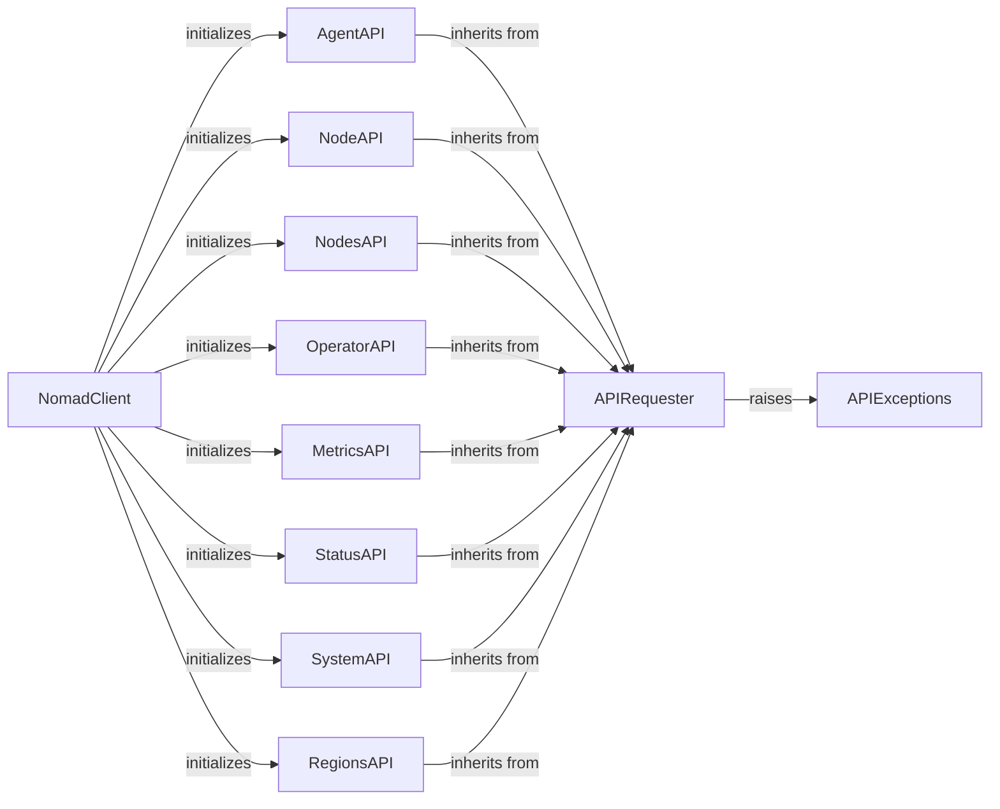

## Component Details

This component overview describes the `Cluster Management` subsystem of Nomad, which provides functionalities for monitoring and controlling the Nomad cluster's infrastructure. It encompasses managing agents and nodes, retrieving cluster status and metrics, performing operator-level actions, and interacting with multi-region deployments. The core interaction flow involves the `NomadClient` initializing various API-specific components, all of which inherit from `APIRequester` to handle HTTP communication with the Nomad API. Error handling is managed by `APIExceptions`.

### NomadClient
The main client component for interacting with the Nomad API. It initializes and provides access to various API-specific client components such as Agent, Node, Status, System, Operator, Metrics, Regions, and Nodes.

**Related Classes/Methods**:

- `nomad.Nomad:__init__` (full file reference)

### APIRequester
A foundational component that serves as the base class for all specific Nomad API client components. It encapsulates the core logic for making HTTP requests to the Nomad API, handling URL building, query string parameters, and common exception handling.

**Related Classes/Methods**:

- <a href="https://github.com/jrxFive/python-nomad/blob/master/nomad/api/base.py#L17-L43" target="_blank" rel="noopener noreferrer">`nomad.api.base.Requester:__init__` (17:43)</a>
- <a href="https://github.com/jrxFive/python-nomad/blob/master/nomad/api/base.py#L103-L120" target="_blank" rel="noopener noreferrer">`nomad.api.base.Requester:request` (103:120)</a>
- <a href="https://github.com/jrxFive/python-nomad/blob/master/nomad/api/base.py#L86-L101" target="_blank" rel="noopener noreferrer">`nomad.api.base.Requester:_query_string_builder` (86:101)</a>
- <a href="https://github.com/jrxFive/python-nomad/blob/master/nomad/api/base.py#L122-L220" target="_blank" rel="noopener noreferrer">`nomad.api.base.Requester:_request` (122:220)</a>
- <a href="https://github.com/jrxFive/python-nomad/blob/master/nomad/api/base.py#L45-L50" target="_blank" rel="noopener noreferrer">`nomad.api.base.Requester:_endpoint_builder` (45:50)</a>
- <a href="https://github.com/jrxFive/python-nomad/blob/master/nomad/api/base.py#L77-L84" target="_blank" rel="noopener noreferrer">`nomad.api.base.Requester:_url_builder` (77:84)</a>
- <a href="https://github.com/jrxFive/python-nomad/blob/master/nomad/api/base.py#L52-L75" target="_blank" rel="noopener noreferrer">`nomad.api.base.Requester:_required_namespace` (52:75)</a>

### AgentAPI
This component provides methods for interacting with the Nomad agent API, allowing operations such as retrieving agent information, managing members, updating servers, and forcing agents to leave the cluster.

**Related Classes/Methods**:

- <a href="https://github.com/jrxFive/python-nomad/blob/master/nomad/api/agent.py#L11-L12" target="_blank" rel="noopener noreferrer">`nomad.api.agent.Agent:__init__` (11:12)</a>
- <a href="https://github.com/jrxFive/python-nomad/blob/master/nomad/api/agent.py#L24-L34" target="_blank" rel="noopener noreferrer">`nomad.api.agent.Agent:get_agent` (24:34)</a>
- <a href="https://github.com/jrxFive/python-nomad/blob/master/nomad/api/agent.py#L36-L46" target="_blank" rel="noopener noreferrer">`nomad.api.agent.Agent:get_members` (36:46)</a>
- <a href="https://github.com/jrxFive/python-nomad/blob/master/nomad/api/agent.py#L48-L58" target="_blank" rel="noopener noreferrer">`nomad.api.agent.Agent:get_servers` (48:58)</a>
- <a href="https://github.com/jrxFive/python-nomad/blob/master/nomad/api/agent.py#L60-L71" target="_blank" rel="noopener noreferrer">`nomad.api.agent.Agent:join_agent` (60:71)</a>
- <a href="https://github.com/jrxFive/python-nomad/blob/master/nomad/api/agent.py#L73-L85" target="_blank" rel="noopener noreferrer">`nomad.api.agent.Agent:update_servers` (73:85)</a>
- <a href="https://github.com/jrxFive/python-nomad/blob/master/nomad/api/agent.py#L87-L98" target="_blank" rel="noopener noreferrer">`nomad.api.agent.Agent:force_leave` (87:98)</a>

### NodeAPI
This component manages interactions with individual Nomad nodes, enabling retrieval of node details, listing allocations on a node, evaluating, draining, and purging nodes.

**Related Classes/Methods**:

- <a href="https://github.com/jrxFive/python-nomad/blob/master/nomad/api/node.py#L19-L20" target="_blank" rel="noopener noreferrer">`nomad.api.node.Node:__init__` (19:20)</a>
- <a href="https://github.com/jrxFive/python-nomad/blob/master/nomad/api/node.py#L32-L37" target="_blank" rel="noopener noreferrer">`nomad.api.node.Node:__contains__` (32:37)</a>
- <a href="https://github.com/jrxFive/python-nomad/blob/master/nomad/api/node.py#L39-L50" target="_blank" rel="noopener noreferrer">`nomad.api.node.Node:__getitem__` (39:50)</a>
- <a href="https://github.com/jrxFive/python-nomad/blob/master/nomad/api/node.py#L52-L62" target="_blank" rel="noopener noreferrer">`nomad.api.node.Node:get_node` (52:62)</a>
- <a href="https://github.com/jrxFive/python-nomad/blob/master/nomad/api/node.py#L64-L74" target="_blank" rel="noopener noreferrer">`nomad.api.node.Node:get_allocations` (64:74)</a>
- <a href="https://github.com/jrxFive/python-nomad/blob/master/nomad/api/node.py#L76-L88" target="_blank" rel="noopener noreferrer">`nomad.api.node.Node:evaluate_node` (76:88)</a>
- <a href="https://github.com/jrxFive/python-nomad/blob/master/nomad/api/node.py#L90-L106" target="_blank" rel="noopener noreferrer">`nomad.api.node.Node:drain_node` (90:106)</a>
- <a href="https://github.com/jrxFive/python-nomad/blob/master/nomad/api/node.py#L108-L144" target="_blank" rel="noopener noreferrer">`nomad.api.node.Node:drain_node_with_spec` (108:144)</a>
- <a href="https://github.com/jrxFive/python-nomad/blob/master/nomad/api/node.py#L146-L181" target="_blank" rel="noopener noreferrer">`nomad.api.node.Node:eligible_node` (146:181)</a>
- <a href="https://github.com/jrxFive/python-nomad/blob/master/nomad/api/node.py#L183-L193" target="_blank" rel="noopener noreferrer">`nomad.api.node.Node:purge_node` (183:193)</a>

### NodesAPI
This component provides functionality to interact with collections of Nomad nodes, allowing for listing and querying multiple nodes.

**Related Classes/Methods**:

- <a href="https://github.com/jrxFive/python-nomad/blob/master/nomad/api/nodes.py#L20-L21" target="_blank" rel="noopener noreferrer">`nomad.api.nodes.Nodes:__init__` (20:21)</a>
- <a href="https://github.com/jrxFive/python-nomad/blob/master/nomad/api/nodes.py#L33-L44" target="_blank" rel="noopener noreferrer">`nomad.api.nodes.Nodes:__contains__` (33:44)</a>
- <a href="https://github.com/jrxFive/python-nomad/blob/master/nomad/api/nodes.py#L46-L48" target="_blank" rel="noopener noreferrer">`nomad.api.nodes.Nodes:__len__` (46:48)</a>
- <a href="https://github.com/jrxFive/python-nomad/blob/master/nomad/api/nodes.py#L50-L61" target="_blank" rel="noopener noreferrer">`nomad.api.nodes.Nodes:__getitem__` (50:61)</a>
- <a href="https://github.com/jrxFive/python-nomad/blob/master/nomad/api/nodes.py#L63-L65" target="_blank" rel="noopener noreferrer">`nomad.api.nodes.Nodes:__iter__` (63:65)</a>
- <a href="https://github.com/jrxFive/python-nomad/blob/master/nomad/api/nodes.py#L67-L95" target="_blank" rel="noopener noreferrer">`nomad.api.nodes.Nodes:get_nodes` (67:95)</a>

### StatusAPI
This component is responsible for retrieving the status of the Nomad cluster, including information about the leader and peers.

**Related Classes/Methods**:

- <a href="https://github.com/jrxFive/python-nomad/blob/master/nomad/api/status.py#L15-L17" target="_blank" rel="noopener noreferrer">`nomad.api.status.Status:__init__` (15:17)</a>
- <a href="https://github.com/jrxFive/python-nomad/blob/master/nomad/api/status.py#L30-L60" target="_blank" rel="noopener noreferrer">`nomad.api.status.Leader` (30:60)</a>
- <a href="https://github.com/jrxFive/python-nomad/blob/master/nomad/api/status.py#L35-L44" target="_blank" rel="noopener noreferrer">`nomad.api.status.Leader:__contains__` (35:44)</a>
- <a href="https://github.com/jrxFive/python-nomad/blob/master/nomad/api/status.py#L46-L48" target="_blank" rel="noopener noreferrer">`nomad.api.status.Leader:__len__` (46:48)</a>
- <a href="https://github.com/jrxFive/python-nomad/blob/master/nomad/api/status.py#L50-L60" target="_blank" rel="noopener noreferrer">`nomad.api.status.Leader:get_leader` (50:60)</a>
- <a href="https://github.com/jrxFive/python-nomad/blob/master/nomad/api/status.py#L63-L108" target="_blank" rel="noopener noreferrer">`nomad.api.status.Peers` (63:108)</a>
- <a href="https://github.com/jrxFive/python-nomad/blob/master/nomad/api/status.py#L68-L77" target="_blank" rel="noopener noreferrer">`nomad.api.status.Peers:__contains__` (68:77)</a>
- <a href="https://github.com/jrxFive/python-nomad/blob/master/nomad/api/status.py#L79-L81" target="_blank" rel="noopener noreferrer">`nomad.api.status.Peers:__len__` (79:81)</a>
- <a href="https://github.com/jrxFive/python-nomad/blob/master/nomad/api/status.py#L83-L92" target="_blank" rel="noopener noreferrer">`nomad.api.status.Peers:__getitem__` (83:92)</a>
- <a href="https://github.com/jrxFive/python-nomad/blob/master/nomad/api/status.py#L94-L96" target="_blank" rel="noopener noreferrer">`nomad.api.status.Peers:__iter__` (94:96)</a>
- <a href="https://github.com/jrxFive/python-nomad/blob/master/nomad/api/status.py#L98-L108" target="_blank" rel="noopener noreferrer">`nomad.api.status.Peers:get_peers` (98:108)</a>

### SystemAPI
This component provides methods for system-wide operations within Nomad, such as initiating garbage collection and reconciling summaries.

**Related Classes/Methods**:

- <a href="https://github.com/jrxFive/python-nomad/blob/master/nomad/api/system.py#L17-L18" target="_blank" rel="noopener noreferrer">`nomad.api.system.System:__init__` (17:18)</a>
- <a href="https://github.com/jrxFive/python-nomad/blob/master/nomad/api/system.py#L30-L40" target="_blank" rel="noopener noreferrer">`nomad.api.system.System:initiate_garbage_collection` (30:40)</a>
- <a href="https://github.com/jrxFive/python-nomad/blob/master/nomad/api/system.py#L42-L52" target="_blank" rel="noopener noreferrer">`nomad.api.system.System:reconcile_summaries` (42:52)</a>

### OperatorAPI
This component allows interaction with Nomad's operator endpoints, providing functionalities like retrieving cluster configuration and deleting peers.

**Related Classes/Methods**:

- <a href="https://github.com/jrxFive/python-nomad/blob/master/nomad/api/operator.py#L16-L17" target="_blank" rel="noopener noreferrer">`nomad.api.operator.Operator:__init__` (16:17)</a>
- <a href="https://github.com/jrxFive/python-nomad/blob/master/nomad/api/operator.py#L29-L44" target="_blank" rel="noopener noreferrer">`nomad.api.operator.Operator:get_configuration` (29:44)</a>
- <a href="https://github.com/jrxFive/python-nomad/blob/master/nomad/api/operator.py#L46-L64" target="_blank" rel="noopener noreferrer">`nomad.api.operator.Operator:delete_peer` (46:64)</a>

### MetricsAPI
This component is dedicated to retrieving metrics from the Nomad cluster.

**Related Classes/Methods**:

- <a href="https://github.com/jrxFive/python-nomad/blob/master/nomad/api/metrics.py#L19-L20" target="_blank" rel="noopener noreferrer">`nomad.api.metrics.Metrics:__init__` (19:20)</a>
- <a href="https://github.com/jrxFive/python-nomad/blob/master/nomad/api/metrics.py#L32-L42" target="_blank" rel="noopener noreferrer">`nomad.api.metrics.Metrics:get_metrics` (32:42)</a>

### RegionsAPI
This component provides methods for interacting with Nomad regions, allowing for listing and querying available regions.

**Related Classes/Methods**:

- <a href="https://github.com/jrxFive/python-nomad/blob/master/nomad/api/regions.py#L15-L16" target="_blank" rel="noopener noreferrer">`nomad.api.regions.Regions:__init__` (15:16)</a>
- <a href="https://github.com/jrxFive/python-nomad/blob/master/nomad/api/regions.py#L28-L37" target="_blank" rel="noopener noreferrer">`nomad.api.regions.Regions:__contains__` (28:37)</a>
- <a href="https://github.com/jrxFive/python-nomad/blob/master/nomad/api/regions.py#L39-L41" target="_blank" rel="noopener noreferrer">`nomad.api.regions.Regions:__len__` (39:41)</a>
- <a href="https://github.com/jrxFive/python-nomad/blob/master/nomad/api/regions.py#L43-L52" target="_blank" rel="noopener noreferrer">`nomad.api.regions.Regions:__getitem__` (43:52)</a>
- <a href="https://github.com/jrxFive/python-nomad/blob/master/nomad/api/regions.py#L54-L56" target="_blank" rel="noopener noreferrer">`nomad.api.regions.Regions:__iter__` (54:56)</a>
- <a href="https://github.com/jrxFive/python-nomad/blob/master/nomad/api/regions.py#L58-L68" target="_blank" rel="noopener noreferrer">`nomad.api.regions.Regions:get_regions` (58:68)</a>

### APIExceptions
This component defines various custom exception classes used throughout the Nomad API client to handle specific error conditions returned by the Nomad server, such as bad requests, unauthorized access, not found errors, and timeouts.

**Related Classes/Methods**:

- <a href="https://github.com/jrxFive/python-nomad/blob/master/nomad/api/exceptions.py#L27-L28" target="_blank" rel="noopener noreferrer">`nomad.api.exceptions.BadRequestNomadException` (27:28)</a>
- <a href="https://github.com/jrxFive/python-nomad/blob/master/nomad/api/exceptions.py#L23-L24" target="_blank" rel="noopener noreferrer">`nomad.api.exceptions.URLNotAuthorizedNomadException` (23:24)</a>
- <a href="https://github.com/jrxFive/python-nomad/blob/master/nomad/api/exceptions.py#L19-L20" target="_blank" rel="noopener noreferrer">`nomad.api.exceptions.URLNotFoundNomadException` (19:20)</a>
- <a href="https://github.com/jrxFive/python-nomad/blob/master/nomad/api/exceptions.py#L31-L32" target="_blank" rel="noopener noreferrer">`nomad.api.exceptions.VariableConflict` (31:32)</a>
- <a href="https://github.com/jrxFive/python-nomad/blob/master/nomad/api/exceptions.py#L6-L16" target="_blank" rel="noopener noreferrer">`nomad.api.exceptions.BaseNomadException` (6:16)</a>
- <a href="https://github.com/jrxFive/python-nomad/blob/master/nomad/api/exceptions.py#L39-L40" target="_blank" rel="noopener noreferrer">`nomad.api.exceptions.TimeoutNomadException` (39:40)</a>

### [FAQ](https://github.com/CodeBoarding/GeneratedOnBoardings/tree/main?tab=readme-ov-file#faq)