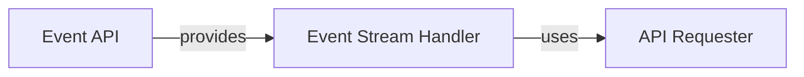

## Component Details

This graph illustrates the core components involved in establishing and managing real-time event streams from the Nomad server. The `Event API` acts as the entry point, providing access to the `Event Stream Handler`. The `Event Stream Handler` is responsible for the actual streaming process, leveraging the `API Requester` for underlying HTTP communication with the Nomad server.

### Event API
This component serves as the primary interface for accessing Nomad event-related functionalities. It initializes and provides access to event streaming capabilities.

**Related Classes/Methods**:

- <a href="https://github.com/jrxFive/python-nomad/blob/master/nomad/api/event.py#L12-L27" target="_blank" rel="noopener noreferrer">`nomad.api.event.Event` (12:27)</a>
- <a href="https://github.com/jrxFive/python-nomad/blob/master/nomad/api/event.py#L26-L27" target="_blank" rel="noopener noreferrer">`nomad.api.event.Event:__init__` (26:27)</a>

### Event Stream Handler
This component is responsible for establishing and maintaining a continuous stream of events from the Nomad API. It handles the underlying network communication, processes incoming event data, and manages the stream lifecycle using a separate thread.

**Related Classes/Methods**:

- <a href="https://github.com/jrxFive/python-nomad/blob/master/nomad/api/event.py#L31-L133" target="_blank" rel="noopener noreferrer">`nomad.api.event.stream` (31:133)</a>
- <a href="https://github.com/jrxFive/python-nomad/blob/master/nomad/api/event.py#L40-L41" target="_blank" rel="noopener noreferrer">`nomad.api.event.stream:__init__` (40:41)</a>
- <a href="https://github.com/jrxFive/python-nomad/blob/master/nomad/api/event.py#L43-L68" target="_blank" rel="noopener noreferrer">`nomad.api.event.stream:_get_stream` (43:68)</a>
- <a href="https://github.com/jrxFive/python-nomad/blob/master/nomad/api/event.py#L70-L133" target="_blank" rel="noopener noreferrer">`nomad.api.event.stream:get_stream` (70:133)</a>

### API Requester
This foundational component provides the core functionality for making HTTP requests to the Nomad API. It manages connection parameters, authentication tokens, and handles various aspects of the request lifecycle, including error handling and response processing.

**Related Classes/Methods**:

- <a href="https://github.com/jrxFive/python-nomad/blob/master/nomad/api/base.py#L10-L220" target="_blank" rel="noopener noreferrer">`nomad.api.base.Requester` (10:220)</a>
- <a href="https://github.com/jrxFive/python-nomad/blob/master/nomad/api/base.py#L17-L43" target="_blank" rel="noopener noreferrer">`nomad.api.base.Requester:__init__` (17:43)</a>
- <a href="https://github.com/jrxFive/python-nomad/blob/master/nomad/api/base.py#L103-L120" target="_blank" rel="noopener noreferrer">`nomad.api.base.Requester:request` (103:120)</a>
- <a href="https://github.com/jrxFive/python-nomad/blob/master/nomad/api/base.py#L122-L220" target="_blank" rel="noopener noreferrer">`nomad.api.base.Requester:_request` (122:220)</a>

### [FAQ](https://github.com/CodeBoarding/GeneratedOnBoardings/tree/main?tab=readme-ov-file#faq)