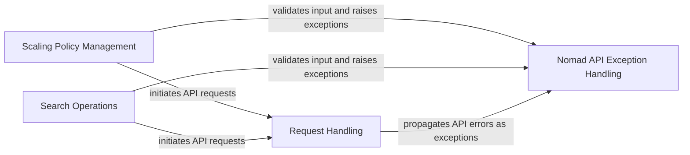

## Component Details

This graph illustrates the core components of the Nomad API client library, focusing on how requests are handled, specific API functionalities are managed (scaling and search), and how errors are uniformly managed through a dedicated exception handling system. The Request Handling component is central to all API interactions, while Scaling Policy Management and Search Operations represent specific API domains. The Nomad API Exception Handling component provides a robust error reporting mechanism across the client library.

### Request Handling
This component is responsible for constructing and sending HTTP requests to the Nomad API. It handles URL and query string building, adds authentication tokens and user agents, processes HTTP responses, and raises specific Nomad API exceptions for different error codes.

**Related Classes/Methods**:

- <a href="https://github.com/jrxFive/python-nomad/blob/master/nomad/api/base.py#L10-L220" target="_blank" rel="noopener noreferrer">`nomad.api.base.Requester` (10:220)</a>
- <a href="https://github.com/jrxFive/python-nomad/blob/master/nomad/api/base.py#L122-L220" target="_blank" rel="noopener noreferrer">`nomad.api.base.Requester:_request` (122:220)</a>
- <a href="https://github.com/jrxFive/python-nomad/blob/master/nomad/api/base.py#L77-L84" target="_blank" rel="noopener noreferrer">`nomad.api.base.Requester._url_builder` (77:84)</a>
- <a href="https://github.com/jrxFive/python-nomad/blob/master/nomad/api/base.py#L86-L101" target="_blank" rel="noopener noreferrer">`nomad.api.base.Requester._query_string_builder` (86:101)</a>
- <a href="https://github.com/jrxFive/python-nomad/blob/master/nomad/api/base.py#L103-L120" target="_blank" rel="noopener noreferrer">`nomad.api.base.Requester.request` (103:120)</a>

### Scaling Policy Management
This component provides an interface to interact with the Nomad API for managing scaling policies. It allows fetching scaling policies and handles invalid parameters specific to scaling policy requests.

**Related Classes/Methods**:

- <a href="https://github.com/jrxFive/python-nomad/blob/master/nomad/api/scaling.py#L8-L74" target="_blank" rel="noopener noreferrer">`nomad.api.scaling.Scaling` (8:74)</a>
- <a href="https://github.com/jrxFive/python-nomad/blob/master/nomad/api/scaling.py#L31-L59" target="_blank" rel="noopener noreferrer">`nomad.api.scaling.Scaling:get_scaling_policies` (31:59)</a>

### Search Operations
This component facilitates searching within the Nomad API, supporting both exact and fuzzy searches across various contexts like jobs, allocations, and nodes. It validates search parameters before making requests.

**Related Classes/Methods**:

- <a href="https://github.com/jrxFive/python-nomad/blob/master/nomad/api/search.py#L8-L98" target="_blank" rel="noopener noreferrer">`nomad.api.search.Search` (8:98)</a>
- <a href="https://github.com/jrxFive/python-nomad/blob/master/nomad/api/search.py#L33-L66" target="_blank" rel="noopener noreferrer">`nomad.api.search.Search:search` (33:66)</a>
- <a href="https://github.com/jrxFive/python-nomad/blob/master/nomad/api/search.py#L68-L98" target="_blank" rel="noopener noreferrer">`nomad.api.search.Search:fuzzy_search` (68:98)</a>

### Nomad API Exception Handling
This component defines a hierarchy of custom exceptions that are raised in response to various error conditions encountered during interactions with the Nomad API, such as bad requests, unauthorized access, not found URLs, and conflicts. It provides specific error information for granular error management and debugging.

**Related Classes/Methods**:

- <a href="https://github.com/jrxFive/python-nomad/blob/master/nomad/api/exceptions.py#L6-L16" target="_blank" rel="noopener noreferrer">`nomad.api.exceptions.BaseNomadException` (6:16)</a>
- <a href="https://github.com/jrxFive/python-nomad/blob/master/nomad/api/exceptions.py#L35-L36" target="_blank" rel="noopener noreferrer">`nomad.api.exceptions.InvalidParameters` (35:36)</a>
- <a href="https://github.com/jrxFive/python-nomad/blob/master/nomad/api/exceptions.py#L27-L28" target="_blank" rel="noopener noreferrer">`nomad.api.exceptions.BadRequestNomadException` (27:28)</a>
- <a href="https://github.com/jrxFive/python-nomad/blob/master/nomad/api/exceptions.py#L23-L24" target="_blank" rel="noopener noreferrer">`nomad.api.exceptions.URLNotAuthorizedNomadException` (23:24)</a>
- <a href="https://github.com/jrxFive/python-nomad/blob/master/nomad/api/exceptions.py#L19-L20" target="_blank" rel="noopener noreferrer">`nomad.api.exceptions.URLNotFoundNomadException` (19:20)</a>
- <a href="https://github.com/jrxFive/python-nomad/blob/master/nomad/api/exceptions.py#L31-L32" target="_blank" rel="noopener noreferrer">`nomad.api.exceptions.VariableConflict` (31:32)</a>
- <a href="https://github.com/jrxFive/python-nomad/blob/master/nomad/api/exceptions.py#L39-L40" target="_blank" rel="noopener noreferrer">`nomad.api.exceptions.TimeoutNomadException` (39:40)</a>

### [FAQ](https://github.com/CodeBoarding/GeneratedOnBoardings/tree/main?tab=readme-ov-file#faq)