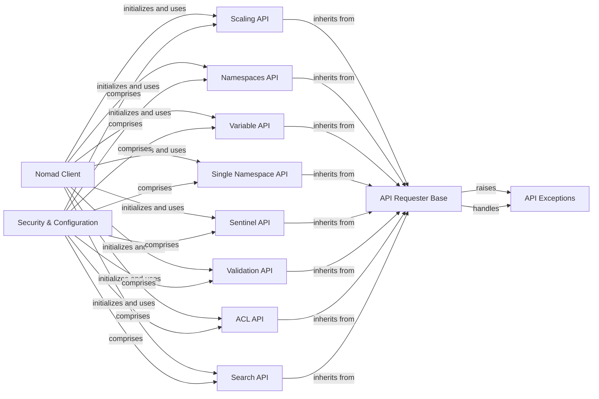

## Component Details

This graph illustrates the architecture of the Nomad client's interaction with the Nomad API, focusing on security and configuration aspects. The `Nomad Client` acts as the primary interface, initializing and utilizing various API components such as `ACL API`, `Namespaces API`, `Variable API`, `Scaling API`, `Search API`, `Sentinel API`, and `Validation API`. All these specific API components inherit from the `API Requester Base`, which handles the fundamental HTTP request logic and error management, including raising and handling `API Exceptions`. The `Security & Configuration` meta-component encapsulates these individual API functionalities, providing a comprehensive view of how access control, organizational structures, dynamic data, and policy enforcement are managed within the Nomad ecosystem.

### Nomad Client
The main client interface for interacting with the Nomad API. It initializes and provides access to various API categories like ACL, Namespaces, Scaling, etc. This component acts as the entry point for users to interact with the Nomad cluster.

**Related Classes/Methods**:

- `python-nomad.nomad.Nomad:__init__` (1:1000)
- `python-nomad.nomad.Nomad.get_uri` (1:1000)

### API Requester Base
This is the foundational component for all Nomad API interactions. It handles the core logic for making HTTP requests to the Nomad server, building endpoints and query strings, and managing common exceptions. All specific API client classes inherit from this base class.

**Related Classes/Methods**:

- <a href="https://github.com/jrxFive/python-nomad/blob/master/nomad/api/base.py#L17-L43" target="_blank" rel="noopener noreferrer">`nomad.api.base.Requester.__init__` (17:43)</a>
- <a href="https://github.com/jrxFive/python-nomad/blob/master/nomad/api/base.py#L86-L101" target="_blank" rel="noopener noreferrer">`nomad.api.base.Requester:_query_string_builder` (86:101)</a>
- <a href="https://github.com/jrxFive/python-nomad/blob/master/nomad/api/base.py#L103-L120" target="_blank" rel="noopener noreferrer">`nomad.api.base.Requester:request` (103:120)</a>
- <a href="https://github.com/jrxFive/python-nomad/blob/master/nomad/api/base.py#L122-L220" target="_blank" rel="noopener noreferrer">`nomad.api.base.Requester:_request` (122:220)</a>
- <a href="https://github.com/jrxFive/python-nomad/blob/master/nomad/api/base.py#L45-L50" target="_blank" rel="noopener noreferrer">`nomad.api.base.Requester._endpoint_builder` (45:50)</a>
- <a href="https://github.com/jrxFive/python-nomad/blob/master/nomad/api/base.py#L77-L84" target="_blank" rel="noopener noreferrer">`nomad.api.base.Requester._url_builder` (77:84)</a>
- <a href="https://github.com/jrxFive/python-nomad/blob/master/nomad/api/base.py#L52-L75" target="_blank" rel="noopener noreferrer">`nomad.api.base.Requester._required_namespace` (52:75)</a>

### Scaling API
This component provides methods for interacting with Nomad's scaling policies. It allows users to retrieve and manage scaling policies within the Nomad cluster.

**Related Classes/Methods**:

- <a href="https://github.com/jrxFive/python-nomad/blob/master/nomad/api/scaling.py#L17-L18" target="_blank" rel="noopener noreferrer">`python-nomad.nomad.api.scaling.Scaling:__init__` (17:18)</a>
- <a href="https://github.com/jrxFive/python-nomad/blob/master/nomad/api/scaling.py#L31-L59" target="_blank" rel="noopener noreferrer">`python-nomad.nomad.api.scaling.Scaling:get_scaling_policies` (31:59)</a>
- <a href="https://github.com/jrxFive/python-nomad/blob/master/nomad/api/scaling.py#L61-L74" target="_blank" rel="noopener noreferrer">`python-nomad.nomad.api.scaling.Scaling:get_scaling_policy` (61:74)</a>

### Namespaces API
This component manages operations related to Nomad namespaces. It enables listing, retrieving, and iterating over namespaces, providing a way to organize resources within the Nomad cluster.

**Related Classes/Methods**:

- <a href="https://github.com/jrxFive/python-nomad/blob/master/nomad/api/namespaces.py#L17-L18" target="_blank" rel="noopener noreferrer">`python-nomad.nomad.api.namespaces.Namespaces:__init__` (17:18)</a>
- <a href="https://github.com/jrxFive/python-nomad/blob/master/nomad/api/namespaces.py#L30-L40" target="_blank" rel="noopener noreferrer">`python-nomad.nomad.api.namespaces.Namespaces:__contains__` (30:40)</a>
- <a href="https://github.com/jrxFive/python-nomad/blob/master/nomad/api/namespaces.py#L42-L44" target="_blank" rel="noopener noreferrer">`python-nomad.nomad.api.namespaces.Namespaces:__len__` (42:44)</a>
- <a href="https://github.com/jrxFive/python-nomad/blob/master/nomad/api/namespaces.py#L46-L56" target="_blank" rel="noopener noreferrer">`python-nomad.nomad.api.namespaces.Namespaces:__getitem__` (46:56)</a>
- <a href="https://github.com/jrxFive/python-nomad/blob/master/nomad/api/namespaces.py#L58-L60" target="_blank" rel="noopener noreferrer">`python-nomad.nomad.api.namespaces.Namespaces:__iter__` (58:60)</a>
- <a href="https://github.com/jrxFive/python-nomad/blob/master/nomad/api/namespaces.py#L62-L75" target="_blank" rel="noopener noreferrer">`python-nomad.nomad.api.namespaces.Namespaces:get_namespaces` (62:75)</a>

### Variable API
This component handles interactions with Nomad variables. It supports operations like retrieving, creating, and deleting variables, which are used for storing sensitive or configuration data.

**Related Classes/Methods**:

- <a href="https://github.com/jrxFive/python-nomad/blob/master/nomad/api/variable.py#L16-L17" target="_blank" rel="noopener noreferrer">`python-nomad.nomad.api.variable.Variable:__init__` (16:17)</a>
- <a href="https://github.com/jrxFive/python-nomad/blob/master/nomad/api/variable.py#L29-L34" target="_blank" rel="noopener noreferrer">`python-nomad.nomad.api.variable.Variable:__contains__` (29:34)</a>
- <a href="https://github.com/jrxFive/python-nomad/blob/master/nomad/api/variable.py#L36-L40" target="_blank" rel="noopener noreferrer">`python-nomad.nomad.api.variable.Variable:__getitem__` (36:40)</a>
- <a href="https://github.com/jrxFive/python-nomad/blob/master/nomad/api/variable.py#L42-L58" target="_blank" rel="noopener noreferrer">`python-nomad.nomad.api.variable.Variable:get_variable` (42:58)</a>
- <a href="https://github.com/jrxFive/python-nomad/blob/master/nomad/api/variable.py#L60-L85" target="_blank" rel="noopener noreferrer">`python-nomad.nomad.api.variable.Variable:create_variable` (60:85)</a>
- <a href="https://github.com/jrxFive/python-nomad/blob/master/nomad/api/variable.py#L87-L111" target="_blank" rel="noopener noreferrer">`python-nomad.nomad.api.variable.Variable:delete_variable` (87:111)</a>

### Single Namespace API
This component provides methods for managing a single Nomad namespace. It allows for creation, retrieval, updating, and deletion of individual namespaces.

**Related Classes/Methods**:

- <a href="https://github.com/jrxFive/python-nomad/blob/master/nomad/api/namespace.py#L18-L19" target="_blank" rel="noopener noreferrer">`python-nomad.nomad.api.namespace.Namespace:__init__` (18:19)</a>
- <a href="https://github.com/jrxFive/python-nomad/blob/master/nomad/api/namespace.py#L31-L36" target="_blank" rel="noopener noreferrer">`python-nomad.nomad.api.namespace.Namespace:__contains__` (31:36)</a>
- <a href="https://github.com/jrxFive/python-nomad/blob/master/nomad/api/namespace.py#L38-L49" target="_blank" rel="noopener noreferrer">`python-nomad.nomad.api.namespace.Namespace:__getitem__` (38:49)</a>
- <a href="https://github.com/jrxFive/python-nomad/blob/master/nomad/api/namespace.py#L51-L63" target="_blank" rel="noopener noreferrer">`python-nomad.nomad.api.namespace.Namespace:get_namespace` (51:63)</a>
- <a href="https://github.com/jrxFive/python-nomad/blob/master/nomad/api/namespace.py#L65-L78" target="_blank" rel="noopener noreferrer">`python-nomad.nomad.api.namespace.Namespace:create_namespace` (65:78)</a>
- <a href="https://github.com/jrxFive/python-nomad/blob/master/nomad/api/namespace.py#L80-L93" target="_blank" rel="noopener noreferrer">`python-nomad.nomad.api.namespace.Namespace:update_namespace` (80:93)</a>
- <a href="https://github.com/jrxFive/python-nomad/blob/master/nomad/api/namespace.py#L95-L107" target="_blank" rel="noopener noreferrer">`python-nomad.nomad.api.namespace.Namespace:delete_namespace` (95:107)</a>

### Sentinel API
This component is responsible for managing Sentinel policies within Nomad. It provides functionalities to get, create, update, and delete Sentinel policies, which are used for fine-grained access control.

**Related Classes/Methods**:

- <a href="https://github.com/jrxFive/python-nomad/blob/master/nomad/api/sentinel.py#L15-L16" target="_blank" rel="noopener noreferrer">`python-nomad.nomad.api.sentinel.Sentinel:__init__` (15:16)</a>
- <a href="https://github.com/jrxFive/python-nomad/blob/master/nomad/api/sentinel.py#L28-L39" target="_blank" rel="noopener noreferrer">`python-nomad.nomad.api.sentinel.Sentinel:get_policies` (28:39)</a>
- <a href="https://github.com/jrxFive/python-nomad/blob/master/nomad/api/sentinel.py#L41-L54" target="_blank" rel="noopener noreferrer">`python-nomad.nomad.api.sentinel.Sentinel:create_policy` (41:54)</a>
- <a href="https://github.com/jrxFive/python-nomad/blob/master/nomad/api/sentinel.py#L56-L67" target="_blank" rel="noopener noreferrer">`python-nomad.nomad.api.sentinel.Sentinel:get_policy` (56:67)</a>
- <a href="https://github.com/jrxFive/python-nomad/blob/master/nomad/api/sentinel.py#L69-L83" target="_blank" rel="noopener noreferrer">`python-nomad.nomad.api.sentinel.Sentinel:update_policy` (69:83)</a>
- <a href="https://github.com/jrxFive/python-nomad/blob/master/nomad/api/sentinel.py#L85-L98" target="_blank" rel="noopener noreferrer">`python-nomad.nomad.api.sentinel.Sentinel:delete_policy` (85:98)</a>

### Validation API
This component offers methods for validating Nomad job specifications. It allows users to check the syntax and structure of job definitions before submission to the Nomad cluster.

**Related Classes/Methods**:

- <a href="https://github.com/jrxFive/python-nomad/blob/master/nomad/api/validate.py#L17-L18" target="_blank" rel="noopener noreferrer">`python-nomad.nomad.api.validate.Validate:__init__` (17:18)</a>
- <a href="https://github.com/jrxFive/python-nomad/blob/master/nomad/api/validate.py#L30-L44" target="_blank" rel="noopener noreferrer">`python-nomad.nomad.api.validate.Validate:validate_job` (30:44)</a>

### ACL API
This component manages Access Control Lists (ACLs) in Nomad. It provides comprehensive functionalities for generating bootstrap tokens, managing tokens (get, create, delete, update), and managing policies (get, create, update, delete).

**Related Classes/Methods**:

- <a href="https://github.com/jrxFive/python-nomad/blob/master/nomad/api/acl.py#L15-L16" target="_blank" rel="noopener noreferrer">`python-nomad.nomad.api.acl.Acl:__init__` (15:16)</a>
- <a href="https://github.com/jrxFive/python-nomad/blob/master/nomad/api/acl.py#L27-L38" target="_blank" rel="noopener noreferrer">`python-nomad.nomad.api.acl.Acl:generate_bootstrap` (27:38)</a>
- <a href="https://github.com/jrxFive/python-nomad/blob/master/nomad/api/acl.py#L40-L52" target="_blank" rel="noopener noreferrer">`python-nomad.nomad.api.acl.Acl:get_tokens` (40:52)</a>
- <a href="https://github.com/jrxFive/python-nomad/blob/master/nomad/api/acl.py#L54-L65" target="_blank" rel="noopener noreferrer">`python-nomad.nomad.api.acl.Acl:get_token` (54:65)</a>
- <a href="https://github.com/jrxFive/python-nomad/blob/master/nomad/api/acl.py#L67-L78" target="_blank" rel="noopener noreferrer">`python-nomad.nomad.api.acl.Acl:get_self_token` (67:78)</a>
- <a href="https://github.com/jrxFive/python-nomad/blob/master/nomad/api/acl.py#L80-L93" target="_blank" rel="noopener noreferrer">`python-nomad.nomad.api.acl.Acl:create_token` (80:93)</a>
- <a href="https://github.com/jrxFive/python-nomad/blob/master/nomad/api/acl.py#L95-L106" target="_blank" rel="noopener noreferrer">`python-nomad.nomad.api.acl.Acl:delete_token` (95:106)</a>
- <a href="https://github.com/jrxFive/python-nomad/blob/master/nomad/api/acl.py#L108-L122" target="_blank" rel="noopener noreferrer">`python-nomad.nomad.api.acl.Acl:update_token` (108:122)</a>
- <a href="https://github.com/jrxFive/python-nomad/blob/master/nomad/api/acl.py#L124-L135" target="_blank" rel="noopener noreferrer">`python-nomad.nomad.api.acl.Acl:get_policies` (124:135)</a>
- <a href="https://github.com/jrxFive/python-nomad/blob/master/nomad/api/acl.py#L137-L150" target="_blank" rel="noopener noreferrer">`python-nomad.nomad.api.acl.Acl:create_policy` (137:150)</a>
- <a href="https://github.com/jrxFive/python-nomad/blob/master/nomad/api/acl.py#L152-L163" target="_blank" rel="noopener noreferrer">`python-nomad.nomad.api.acl.Acl:get_policy` (152:163)</a>
- <a href="https://github.com/jrxFive/python-nomad/blob/master/nomad/api/acl.py#L165-L179" target="_blank" rel="noopener noreferrer">`python-nomad.nomad.api.acl.Acl:update_policy` (165:179)</a>
- <a href="https://github.com/jrxFive/python-nomad/blob/master/nomad/api/acl.py#L181-L194" target="_blank" rel="noopener noreferrer">`python-nomad.nomad.api.acl.Acl:delete_policy` (181:194)</a>

### API Exceptions
This component defines custom exception classes specific to the Nomad API. These exceptions are raised by the API Requester Base component to indicate various error conditions encountered during API interactions, such as bad requests, unauthorized access, or timeouts.

**Related Classes/Methods**:

- <a href="https://github.com/jrxFive/python-nomad/blob/master/nomad/api/exceptions.py#L35-L36" target="_blank" rel="noopener noreferrer">`nomad.api.exceptions.InvalidParameters` (35:36)</a>
- <a href="https://github.com/jrxFive/python-nomad/blob/master/nomad/api/exceptions.py#L27-L28" target="_blank" rel="noopener noreferrer">`nomad.api.exceptions.BadRequestNomadException` (27:28)</a>
- <a href="https://github.com/jrxFive/python-nomad/blob/master/nomad/api/exceptions.py#L23-L24" target="_blank" rel="noopener noreferrer">`nomad.api.exceptions.URLNotAuthorizedNomadException` (23:24)</a>
- <a href="https://github.com/jrxFive/python-nomad/blob/master/nomad/api/exceptions.py#L19-L20" target="_blank" rel="noopener noreferrer">`nomad.api.exceptions.URLNotFoundNomadException` (19:20)</a>
- <a href="https://github.com/jrxFive/python-nomad/blob/master/nomad/api/exceptions.py#L31-L32" target="_blank" rel="noopener noreferrer">`nomad.api.exceptions.VariableConflict` (31:32)</a>
- <a href="https://github.com/jrxFive/python-nomad/blob/master/nomad/api/exceptions.py#L6-L16" target="_blank" rel="noopener noreferrer">`nomad.api.exceptions.BaseNomadException` (6:16)</a>
- <a href="https://github.com/jrxFive/python-nomad/blob/master/nomad/api/exceptions.py#L39-L40" target="_blank" rel="noopener noreferrer">`nomad.api.exceptions.TimeoutNomadException` (39:40)</a>

### Search API
This component provides methods for searching various Nomad resources like jobs, allocations, nodes, and plugins, supporting both exact prefix matches and fuzzy searching.

**Related Classes/Methods**:

- <a href="https://github.com/jrxFive/python-nomad/blob/master/nomad/api/search.py#L20-L21" target="_blank" rel="noopener noreferrer">`python-nomad.nomad.api.search.Search:__init__` (20:21)</a>
- <a href="https://github.com/jrxFive/python-nomad/blob/master/nomad/api/search.py#L33-L66" target="_blank" rel="noopener noreferrer">`python-nomad.nomad.api.search.Search:search` (33:66)</a>
- <a href="https://github.com/jrxFive/python-nomad/blob/master/nomad/api/search.py#L68-L98" target="_blank" rel="noopener noreferrer">`python-nomad.nomad.api.search.Search:fuzzy_search` (68:98)</a>

### Security & Configuration
This meta-component encapsulates the functionalities related to access control, organizational structures, dynamic data management, and policy enforcement within Nomad. It provides a unified view of how security, configuration, and operational policies are managed and applied across the Nomad cluster.

**Related Classes/Methods**:

- <a href="https://github.com/jrxFive/python-nomad/blob/master/nomad/api/acl.py#L6-L194" target="_blank" rel="noopener noreferrer">`nomad.api.acl.Acl` (6:194)</a>
- <a href="https://github.com/jrxFive/python-nomad/blob/master/nomad/api/namespace.py#L8-L107" target="_blank" rel="noopener noreferrer">`nomad.api.namespace.Namespace` (8:107)</a>
- <a href="https://github.com/jrxFive/python-nomad/blob/master/nomad/api/namespaces.py#L8-L75" target="_blank" rel="noopener noreferrer">`nomad.api.namespaces.Namespaces` (8:75)</a>
- <a href="https://github.com/jrxFive/python-nomad/blob/master/nomad/api/variable.py#L8-L111" target="_blank" rel="noopener noreferrer">`nomad.api.variable.Variable` (8:111)</a>
- <a href="https://github.com/jrxFive/python-nomad/blob/master/nomad/api/variables.py#L6-L66" target="_blank" rel="noopener noreferrer">`nomad.api.variables.Variables` (6:66)</a>
- <a href="https://github.com/jrxFive/python-nomad/blob/master/nomad/api/scaling.py#L8-L74" target="_blank" rel="noopener noreferrer">`nomad.api.scaling.Scaling` (8:74)</a>
- <a href="https://github.com/jrxFive/python-nomad/blob/master/nomad/api/search.py#L8-L98" target="_blank" rel="noopener noreferrer">`nomad.api.search.Search` (8:98)</a>
- <a href="https://github.com/jrxFive/python-nomad/blob/master/nomad/api/sentinel.py#L6-L98" target="_blank" rel="noopener noreferrer">`nomad.api.sentinel.Sentinel` (6:98)</a>
- <a href="https://github.com/jrxFive/python-nomad/blob/master/nomad/api/validate.py#L6-L44" target="_blank" rel="noopener noreferrer">`nomad.api.validate.Validate` (6:44)</a>

### [FAQ](https://github.com/CodeBoarding/GeneratedOnBoardings/tree/main?tab=readme-ov-file#faq)