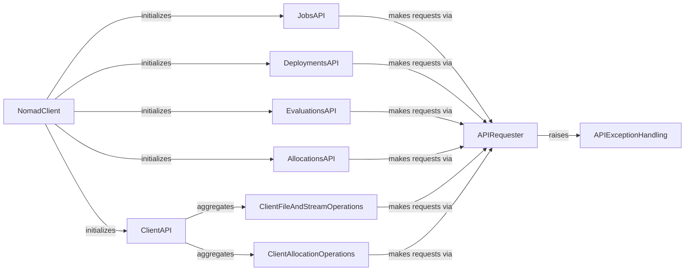

## Component Details

This graph illustrates the Workload Orchestration subsystem within Nomad, focusing on how the `NomadClient` acts as the central entry point to various API components like `JobsAPI`, `DeploymentsAPI`, `EvaluationsAPI`, and `AllocationsAPI`. These API components, along with `ClientFileAndStreamOperations` and `ClientAllocationOperations` (aggregated by `ClientAPI`), all rely on the `APIRequester` for handling HTTP requests and error management, which in turn raises specific `APIExceptionHandling` exceptions for different failure scenarios. The main flow involves the `NomadClient` initializing and providing access to these specialized API interfaces for managing the lifecycle of applications and services in Nomad.

### NomadClient
This is the main entry point for interacting with the Nomad API. It initializes various API client objects for different Nomad resources like jobs, allocations, deployments, evaluations, and client-side operations.

**Related Classes/Methods**:

- `nomad.Nomad` (7:32)
- `nomad.Nomad.get_uri` (full file reference)

### APIRequester
This component provides the fundamental request-making capabilities for all Nomad API interactions. It handles URL building, query string parameters, and is responsible for executing HTTP requests and handling common API errors.

**Related Classes/Methods**:

- <a href="https://github.com/jrxFive/python-nomad/blob/master/nomad/api/base.py#L10-L220" target="_blank" rel="noopener noreferrer">`nomad.api.base.Requester` (10:220)</a>
- <a href="https://github.com/jrxFive/python-nomad/blob/master/nomad/api/base.py#L86-L101" target="_blank" rel="noopener noreferrer">`nomad.api.base.Requester._query_string_builder` (86:101)</a>
- <a href="https://github.com/jrxFive/python-nomad/blob/master/nomad/api/base.py#L52-L75" target="_blank" rel="noopener noreferrer">`nomad.api.base.Requester._required_namespace` (52:75)</a>
- <a href="https://github.com/jrxFive/python-nomad/blob/master/nomad/api/base.py#L103-L120" target="_blank" rel="noopener noreferrer">`nomad.api.base.Requester.request` (103:120)</a>
- <a href="https://github.com/jrxFive/python-nomad/blob/master/nomad/api/base.py#L122-L220" target="_blank" rel="noopener noreferrer">`nomad.api.base.Requester._request` (122:220)</a>
- <a href="https://github.com/jrxFive/python-nomad/blob/master/nomad/api/base.py#L45-L50" target="_blank" rel="noopener noreferrer">`nomad.api.base.Requester._endpoint_builder` (45:50)</a>
- <a href="https://github.com/jrxFive/python-nomad/blob/master/nomad/api/base.py#L77-L84" target="_blank" rel="noopener noreferrer">`nomad.api.base.Requester._url_builder` (77:84)</a>

### JobsAPI
This component provides methods for managing Nomad jobs, including listing all jobs, retrieving details of a specific job, registering new jobs, and performing various job-related actions like planning, evaluating, and deregistering.

**Related Classes/Methods**:

- <a href="https://github.com/jrxFive/python-nomad/blob/master/nomad/api/jobs.py#L9-L127" target="_blank" rel="noopener noreferrer">`nomad.api.jobs.Jobs` (9:127)</a>
- <a href="https://github.com/jrxFive/python-nomad/blob/master/nomad/api/jobs.py#L20-L21" target="_blank" rel="noopener noreferrer">`nomad.api.jobs.Jobs.__init__` (20:21)</a>
- <a href="https://github.com/jrxFive/python-nomad/blob/master/nomad/api/jobs.py#L33-L44" target="_blank" rel="noopener noreferrer">`nomad.api.jobs.Jobs.__contains__` (33:44)</a>
- <a href="https://github.com/jrxFive/python-nomad/blob/master/nomad/api/jobs.py#L46-L48" target="_blank" rel="noopener noreferrer">`nomad.api.jobs.Jobs.__len__` (46:48)</a>
- <a href="https://github.com/jrxFive/python-nomad/blob/master/nomad/api/jobs.py#L50-L61" target="_blank" rel="noopener noreferrer">`nomad.api.jobs.Jobs.__getitem__` (50:61)</a>
- <a href="https://github.com/jrxFive/python-nomad/blob/master/nomad/api/jobs.py#L63-L65" target="_blank" rel="noopener noreferrer">`nomad.api.jobs.Jobs.__iter__` (63:65)</a>
- <a href="https://github.com/jrxFive/python-nomad/blob/master/nomad/api/jobs.py#L67-L97" target="_blank" rel="noopener noreferrer">`nomad.api.jobs.Jobs.get_jobs` (67:97)</a>
- <a href="https://github.com/jrxFive/python-nomad/blob/master/nomad/api/jobs.py#L99-L109" target="_blank" rel="noopener noreferrer">`nomad.api.jobs.Jobs.register_job` (99:109)</a>
- <a href="https://github.com/jrxFive/python-nomad/blob/master/nomad/api/jobs.py#L111-L127" target="_blank" rel="noopener noreferrer">`nomad.api.jobs.Jobs.parse` (111:127)</a>
- <a href="https://github.com/jrxFive/python-nomad/blob/master/nomad/api/job.py#L9-L363" target="_blank" rel="noopener noreferrer">`nomad.api.job.Job` (9:363)</a>
- <a href="https://github.com/jrxFive/python-nomad/blob/master/nomad/api/job.py#L19-L20" target="_blank" rel="noopener noreferrer">`nomad.api.job.Job.__init__` (19:20)</a>
- <a href="https://github.com/jrxFive/python-nomad/blob/master/nomad/api/job.py#L32-L37" target="_blank" rel="noopener noreferrer">`nomad.api.job.Job.__contains__` (32:37)</a>
- <a href="https://github.com/jrxFive/python-nomad/blob/master/nomad/api/job.py#L39-L49" target="_blank" rel="noopener noreferrer">`nomad.api.job.Job.__getitem__` (39:49)</a>
- <a href="https://github.com/jrxFive/python-nomad/blob/master/nomad/api/job.py#L51-L70" target="_blank" rel="noopener noreferrer">`nomad.api.job.Job.get_job` (51:70)</a>
- <a href="https://github.com/jrxFive/python-nomad/blob/master/nomad/api/job.py#L72-L84" target="_blank" rel="noopener noreferrer">`nomad.api.job.Job.get_versions` (72:84)</a>
- <a href="https://github.com/jrxFive/python-nomad/blob/master/nomad/api/job.py#L86-L112" target="_blank" rel="noopener noreferrer">`nomad.api.job.Job.get_allocations` (86:112)</a>
- <a href="https://github.com/jrxFive/python-nomad/blob/master/nomad/api/job.py#L114-L137" target="_blank" rel="noopener noreferrer">`nomad.api.job.Job.get_evaluations` (114:137)</a>
- <a href="https://github.com/jrxFive/python-nomad/blob/master/nomad/api/job.py#L139-L151" target="_blank" rel="noopener noreferrer">`nomad.api.job.Job.get_deployments` (139:151)</a>
- <a href="https://github.com/jrxFive/python-nomad/blob/master/nomad/api/job.py#L153-L165" target="_blank" rel="noopener noreferrer">`nomad.api.job.Job.get_deployment` (153:165)</a>
- <a href="https://github.com/jrxFive/python-nomad/blob/master/nomad/api/job.py#L167-L179" target="_blank" rel="noopener noreferrer">`nomad.api.job.Job.get_summary` (167:179)</a>
- <a href="https://github.com/jrxFive/python-nomad/blob/master/nomad/api/job.py#L181-L193" target="_blank" rel="noopener noreferrer">`nomad.api.job.Job.register_job` (181:193)</a>
- <a href="https://github.com/jrxFive/python-nomad/blob/master/nomad/api/job.py#L195-L208" target="_blank" rel="noopener noreferrer">`nomad.api.job.Job.evaluate_job` (195:208)</a>
- <a href="https://github.com/jrxFive/python-nomad/blob/master/nomad/api/job.py#L210-L229" target="_blank" rel="noopener noreferrer">`nomad.api.job.Job.plan_job` (210:229)</a>
- <a href="https://github.com/jrxFive/python-nomad/blob/master/nomad/api/job.py#L231-L246" target="_blank" rel="noopener noreferrer">`nomad.api.job.Job.periodic_job` (231:246)</a>
- <a href="https://github.com/jrxFive/python-nomad/blob/master/nomad/api/job.py#L248-L277" target="_blank" rel="noopener noreferrer">`nomad.api.job.Job.dispatch_job` (248:277)</a>
- <a href="https://github.com/jrxFive/python-nomad/blob/master/nomad/api/job.py#L279-L301" target="_blank" rel="noopener noreferrer">`nomad.api.job.Job.revert_job` (279:301)</a>
- <a href="https://github.com/jrxFive/python-nomad/blob/master/nomad/api/job.py#L303-L318" target="_blank" rel="noopener noreferrer">`nomad.api.job.Job.stable_job` (303:318)</a>
- <a href="https://github.com/jrxFive/python-nomad/blob/master/nomad/api/job.py#L320-L363" target="_blank" rel="noopener noreferrer">`nomad.api.job.Job.deregister_job` (320:363)</a>

### DeploymentsAPI
This component handles interactions with Nomad deployments, allowing listing all deployments, retrieving details of a specific deployment, and managing deployment lifecycle actions such as pausing, promoting, and failing.

**Related Classes/Methods**:

- <a href="https://github.com/jrxFive/python-nomad/blob/master/nomad/api/deployments.py#L8-L78" target="_blank" rel="noopener noreferrer">`nomad.api.deployments.Deployments` (8:78)</a>
- <a href="https://github.com/jrxFive/python-nomad/blob/master/nomad/api/deployments.py#L17-L18" target="_blank" rel="noopener noreferrer">`nomad.api.deployments.Deployments.__init__` (17:18)</a>
- <a href="https://github.com/jrxFive/python-nomad/blob/master/nomad/api/deployments.py#L29-L31" target="_blank" rel="noopener noreferrer">`nomad.api.deployments.Deployments.__len__` (29:31)</a>
- <a href="https://github.com/jrxFive/python-nomad/blob/master/nomad/api/deployments.py#L33-L35" target="_blank" rel="noopener noreferrer">`nomad.api.deployments.Deployments.__iter__` (33:35)</a>
- <a href="https://github.com/jrxFive/python-nomad/blob/master/nomad/api/deployments.py#L37-L46" target="_blank" rel="noopener noreferrer">`nomad.api.deployments.Deployments.__contains__` (37:46)</a>
- <a href="https://github.com/jrxFive/python-nomad/blob/master/nomad/api/deployments.py#L48-L56" target="_blank" rel="noopener noreferrer">`nomad.api.deployments.Deployments.__getitem__` (48:56)</a>
- <a href="https://github.com/jrxFive/python-nomad/blob/master/nomad/api/deployments.py#L58-L78" target="_blank" rel="noopener noreferrer">`nomad.api.deployments.Deployments.get_deployments` (58:78)</a>
- <a href="https://github.com/jrxFive/python-nomad/blob/master/nomad/api/deployment.py#L8-L172" target="_blank" rel="noopener noreferrer">`nomad.api.deployment.Deployment` (8:172)</a>
- <a href="https://github.com/jrxFive/python-nomad/blob/master/nomad/api/deployment.py#L17-L18" target="_blank" rel="noopener noreferrer">`nomad.api.deployment.Deployment.__init__` (17:18)</a>
- <a href="https://github.com/jrxFive/python-nomad/blob/master/nomad/api/deployment.py#L30-L35" target="_blank" rel="noopener noreferrer">`nomad.api.deployment.Deployment.__contains__` (30:35)</a>
- <a href="https://github.com/jrxFive/python-nomad/blob/master/nomad/api/deployment.py#L37-L44" target="_blank" rel="noopener noreferrer">`nomad.api.deployment.Deployment.__getitem__` (37:44)</a>
- <a href="https://github.com/jrxFive/python-nomad/blob/master/nomad/api/deployment.py#L46-L58" target="_blank" rel="noopener noreferrer">`nomad.api.deployment.Deployment.get_deployment` (46:58)</a>
- <a href="https://github.com/jrxFive/python-nomad/blob/master/nomad/api/deployment.py#L60-L72" target="_blank" rel="noopener noreferrer">`nomad.api.deployment.Deployment.get_deployment_allocations` (60:72)</a>
- <a href="https://github.com/jrxFive/python-nomad/blob/master/nomad/api/deployment.py#L74-L88" target="_blank" rel="noopener noreferrer">`nomad.api.deployment.Deployment.fail_deployment` (74:88)</a>
- <a href="https://github.com/jrxFive/python-nomad/blob/master/nomad/api/deployment.py#L90-L105" target="_blank" rel="noopener noreferrer">`nomad.api.deployment.Deployment.pause_deployment` (90:105)</a>
- <a href="https://github.com/jrxFive/python-nomad/blob/master/nomad/api/deployment.py#L107-L122" target="_blank" rel="noopener noreferrer">`nomad.api.deployment.Deployment.promote_deployment_all` (107:122)</a>
- <a href="https://github.com/jrxFive/python-nomad/blob/master/nomad/api/deployment.py#L124-L141" target="_blank" rel="noopener noreferrer">`nomad.api.deployment.Deployment.promote_deployment_groups` (124:141)</a>
- <a href="https://github.com/jrxFive/python-nomad/blob/master/nomad/api/deployment.py#L143-L172" target="_blank" rel="noopener noreferrer">`nomad.api.deployment.Deployment.deployment_allocation_health` (143:172)</a>

### EvaluationsAPI
This component provides an interface for querying and managing Nomad evaluations, which represent the outcome of job submissions and updates. It allows listing all evaluations and retrieving details for a specific evaluation.

**Related Classes/Methods**:

- <a href="https://github.com/jrxFive/python-nomad/blob/master/nomad/api/evaluations.py#L8-L75" target="_blank" rel="noopener noreferrer">`nomad.api.evaluations.Evaluations` (8:75)</a>
- <a href="https://github.com/jrxFive/python-nomad/blob/master/nomad/api/evaluations.py#L19-L20" target="_blank" rel="noopener noreferrer">`nomad.api.evaluations.Evaluations.__init__` (19:20)</a>
- <a href="https://github.com/jrxFive/python-nomad/blob/master/nomad/api/evaluations.py#L31-L41" target="_blank" rel="noopener noreferrer">`nomad.api.evaluations.Evaluations.__contains__` (31:41)</a>
- <a href="https://github.com/jrxFive/python-nomad/blob/master/nomad/api/evaluations.py#L43-L45" target="_blank" rel="noopener noreferrer">`nomad.api.evaluations.Evaluations.__len__` (43:45)</a>
- <a href="https://github.com/jrxFive/python-nomad/blob/master/nomad/api/evaluations.py#L47-L56" target="_blank" rel="noopener noreferrer">`nomad.api.evaluations.Evaluations.__getitem__` (47:56)</a>
- <a href="https://github.com/jrxFive/python-nomad/blob/master/nomad/api/evaluations.py#L58-L60" target="_blank" rel="noopener noreferrer">`nomad.api.evaluations.Evaluations.__iter__` (58:60)</a>
- <a href="https://github.com/jrxFive/python-nomad/blob/master/nomad/api/evaluations.py#L62-L75" target="_blank" rel="noopener noreferrer">`nomad.api.evaluations.Evaluations.get_evaluations` (62:75)</a>
- <a href="https://github.com/jrxFive/python-nomad/blob/master/nomad/api/evaluation.py#L8-L74" target="_blank" rel="noopener noreferrer">`nomad.api.evaluation.Evaluation` (8:74)</a>
- <a href="https://github.com/jrxFive/python-nomad/blob/master/nomad/api/evaluation.py#L19-L20" target="_blank" rel="noopener noreferrer">`nomad.api.evaluation.Evaluation.__init__` (19:20)</a>
- <a href="https://github.com/jrxFive/python-nomad/blob/master/nomad/api/evaluation.py#L32-L37" target="_blank" rel="noopener noreferrer">`nomad.api.evaluation.Evaluation.__contains__` (32:37)</a>
- <a href="https://github.com/jrxFive/python-nomad/blob/master/nomad/api/evaluation.py#L39-L46" target="_blank" rel="noopener noreferrer">`nomad.api.evaluation.Evaluation.__getitem__` (39:46)</a>
- <a href="https://github.com/jrxFive/python-nomad/blob/master/nomad/api/evaluation.py#L48-L60" target="_blank" rel="noopener noreferrer">`nomad.api.evaluation.Evaluation.get_evaluation` (48:60)</a>
- <a href="https://github.com/jrxFive/python-nomad/blob/master/nomad/api/evaluation.py#L62-L74" target="_blank" rel="noopener noreferrer">`nomad.api.evaluation.Evaluation.get_allocations` (62:74)</a>

### AllocationsAPI
This component manages Nomad allocations, which are the actual instances of tasks running on client nodes. It allows listing all allocations, retrieving details about a specific allocation, and stopping allocations.

**Related Classes/Methods**:

- <a href="https://github.com/jrxFive/python-nomad/blob/master/nomad/api/allocations.py#L8-L83" target="_blank" rel="noopener noreferrer">`nomad.api.allocations.Allocations` (8:83)</a>
- <a href="https://github.com/jrxFive/python-nomad/blob/master/nomad/api/allocations.py#L19-L20" target="_blank" rel="noopener noreferrer">`nomad.api.allocations.Allocations.__init__` (19:20)</a>
- <a href="https://github.com/jrxFive/python-nomad/blob/master/nomad/api/allocations.py#L31-L33" target="_blank" rel="noopener noreferrer">`nomad.api.allocations.Allocations.__len__` (31:33)</a>
- <a href="https://github.com/jrxFive/python-nomad/blob/master/nomad/api/allocations.py#L35-L37" target="_blank" rel="noopener noreferrer">`nomad.api.allocations.Allocations.__iter__` (35:37)</a>
- <a href="https://github.com/jrxFive/python-nomad/blob/master/nomad/api/allocations.py#L39-L83" target="_blank" rel="noopener noreferrer">`nomad.api.allocations.Allocations.get_allocations` (39:83)</a>
- <a href="https://github.com/jrxFive/python-nomad/blob/master/nomad/api/allocation.py#L8-L73" target="_blank" rel="noopener noreferrer">`nomad.api.allocation.Allocation` (8:73)</a>
- <a href="https://github.com/jrxFive/python-nomad/blob/master/nomad/api/allocation.py#L19-L20" target="_blank" rel="noopener noreferrer">`nomad.api.allocation.Allocation.__init__` (19:20)</a>
- <a href="https://github.com/jrxFive/python-nomad/blob/master/nomad/api/allocation.py#L31-L39" target="_blank" rel="noopener noreferrer">`nomad.api.allocation.Allocation.__contains__` (31:39)</a>
- <a href="https://github.com/jrxFive/python-nomad/blob/master/nomad/api/allocation.py#L41-L49" target="_blank" rel="noopener noreferrer">`nomad.api.allocation.Allocation.__getitem__` (41:49)</a>
- <a href="https://github.com/jrxFive/python-nomad/blob/master/nomad/api/allocation.py#L51-L61" target="_blank" rel="noopener noreferrer">`nomad.api.allocation.Allocation.get_allocation` (51:61)</a>
- <a href="https://github.com/jrxFive/python-nomad/blob/master/nomad/api/allocation.py#L63-L73" target="_blank" rel="noopener noreferrer">`nomad.api.allocation.Allocation.stop_allocation` (63:73)</a>

### ClientAPI
This component acts as a facade for various client-side operations within Nomad, aggregating functionalities related to file system interactions, streaming data, and specific allocation management on client nodes.

**Related Classes/Methods**:

- <a href="https://github.com/jrxFive/python-nomad/blob/master/nomad/api/client.py#L7-L32" target="_blank" rel="noopener noreferrer">`nomad.api.client.Client` (7:32)</a>
- <a href="https://github.com/jrxFive/python-nomad/blob/master/nomad/api/client.py#L12-L22" target="_blank" rel="noopener noreferrer">`nomad.api.client.Client.__init__` (12:22)</a>

### ClientFileAndStreamOperations
This component provides functionalities for interacting with the file system on Nomad client nodes, including listing files, reading file content, and streaming logs or file data from allocations.

**Related Classes/Methods**:

- <a href="https://github.com/jrxFive/python-nomad/blob/master/nomad/api/client.py#L35-L65" target="_blank" rel="noopener noreferrer">`nomad.api.client.ls` (35:65)</a>
- <a href="https://github.com/jrxFive/python-nomad/blob/master/nomad/api/client.py#L46-L47" target="_blank" rel="noopener noreferrer">`nomad.api.client.ls.__init__` (46:47)</a>
- <a href="https://github.com/jrxFive/python-nomad/blob/master/nomad/api/client.py#L49-L65" target="_blank" rel="noopener noreferrer">`nomad.api.client.ls.list_files` (49:65)</a>
- <a href="https://github.com/jrxFive/python-nomad/blob/master/nomad/api/client.py#L68-L99" target="_blank" rel="noopener noreferrer">`nomad.api.client.cat` (68:99)</a>
- <a href="https://github.com/jrxFive/python-nomad/blob/master/nomad/api/client.py#L80-L81" target="_blank" rel="noopener noreferrer">`nomad.api.client.cat.__init__` (80:81)</a>
- <a href="https://github.com/jrxFive/python-nomad/blob/master/nomad/api/client.py#L83-L99" target="_blank" rel="noopener noreferrer">`nomad.api.client.cat.read_file` (83:99)</a>
- <a href="https://github.com/jrxFive/python-nomad/blob/master/nomad/api/client.py#L205-L235" target="_blank" rel="noopener noreferrer">`nomad.api.client.stat` (205:235)</a>
- <a href="https://github.com/jrxFive/python-nomad/blob/master/nomad/api/client.py#L216-L217" target="_blank" rel="noopener noreferrer">`nomad.api.client.stat.__init__` (216:217)</a>
- <a href="https://github.com/jrxFive/python-nomad/blob/master/nomad/api/client.py#L219-L235" target="_blank" rel="noopener noreferrer">`nomad.api.client.stat.stat_file` (219:235)</a>
- <a href="https://github.com/jrxFive/python-nomad/blob/master/nomad/api/client.py#L102-L130" target="_blank" rel="noopener noreferrer">`nomad.api.client.read_at` (102:130)</a>
- <a href="https://github.com/jrxFive/python-nomad/blob/master/nomad/api/client.py#L111-L112" target="_blank" rel="noopener noreferrer">`nomad.api.client.read_at.__init__` (111:112)</a>
- <a href="https://github.com/jrxFive/python-nomad/blob/master/nomad/api/client.py#L114-L130" target="_blank" rel="noopener noreferrer">`nomad.api.client.read_at.read_file_offset` (114:130)</a>
- <a href="https://github.com/jrxFive/python-nomad/blob/master/nomad/api/client.py#L133-L161" target="_blank" rel="noopener noreferrer">`nomad.api.client.stream_file` (133:161)</a>
- <a href="https://github.com/jrxFive/python-nomad/blob/master/nomad/api/client.py#L142-L143" target="_blank" rel="noopener noreferrer">`nomad.api.client.stream_file.__init__` (142:143)</a>
- <a href="https://github.com/jrxFive/python-nomad/blob/master/nomad/api/client.py#L145-L161" target="_blank" rel="noopener noreferrer">`nomad.api.client.stream_file.stream` (145:161)</a>
- <a href="https://github.com/jrxFive/python-nomad/blob/master/nomad/api/client.py#L164-L202" target="_blank" rel="noopener noreferrer">`nomad.api.client.stream_logs` (164:202)</a>
- <a href="https://github.com/jrxFive/python-nomad/blob/master/nomad/api/client.py#L173-L174" target="_blank" rel="noopener noreferrer">`nomad.api.client.stream_logs.__init__` (173:174)</a>
- <a href="https://github.com/jrxFive/python-nomad/blob/master/nomad/api/client.py#L176-L202" target="_blank" rel="noopener noreferrer">`nomad.api.client.stream_logs.stream` (176:202)</a>

### ClientAllocationOperations
This component manages specific allocation-related operations on Nomad client nodes, such as reading allocation statistics, restarting or signaling allocations, and performing garbage collection on allocations.

**Related Classes/Methods**:

- <a href="https://github.com/jrxFive/python-nomad/blob/master/nomad/api/client.py#L267-L321" target="_blank" rel="noopener noreferrer">`nomad.api.client.allocation` (267:321)</a>
- <a href="https://github.com/jrxFive/python-nomad/blob/master/nomad/api/client.py#L279-L280" target="_blank" rel="noopener noreferrer">`nomad.api.client.allocation.__init__` (279:280)</a>
- <a href="https://github.com/jrxFive/python-nomad/blob/master/nomad/api/client.py#L282-L293" target="_blank" rel="noopener noreferrer">`nomad.api.client.allocation.read_allocation_stats` (282:293)</a>
- <a href="https://github.com/jrxFive/python-nomad/blob/master/nomad/api/client.py#L295-L305" target="_blank" rel="noopener noreferrer">`nomad.api.client.allocation.restart_allocation` (295:305)</a>
- <a href="https://github.com/jrxFive/python-nomad/blob/master/nomad/api/client.py#L307-L321" target="_blank" rel="noopener noreferrer">`nomad.api.client.allocation.signal_allocation` (307:321)</a>
- <a href="https://github.com/jrxFive/python-nomad/blob/master/nomad/api/client.py#L238-L264" target="_blank" rel="noopener noreferrer">`nomad.api.client.stats` (238:264)</a>
- <a href="https://github.com/jrxFive/python-nomad/blob/master/nomad/api/client.py#L249-L250" target="_blank" rel="noopener noreferrer">`nomad.api.client.stats.__init__` (249:250)</a>
- <a href="https://github.com/jrxFive/python-nomad/blob/master/nomad/api/client.py#L252-L264" target="_blank" rel="noopener noreferrer">`nomad.api.client.stats.read_stats` (252:264)</a>
- <a href="https://github.com/jrxFive/python-nomad/blob/master/nomad/api/client.py#L324-L347" target="_blank" rel="noopener noreferrer">`nomad.api.client.gc_allocation` (324:347)</a>
- <a href="https://github.com/jrxFive/python-nomad/blob/master/nomad/api/client.py#L333-L334" target="_blank" rel="noopener noreferrer">`nomad.api.client.gc_allocation.__init__` (333:334)</a>
- <a href="https://github.com/jrxFive/python-nomad/blob/master/nomad/api/client.py#L336-L347" target="_blank" rel="noopener noreferrer">`nomad.api.client.gc_allocation.garbage_collect` (336:347)</a>
- <a href="https://github.com/jrxFive/python-nomad/blob/master/nomad/api/client.py#L350-L372" target="_blank" rel="noopener noreferrer">`nomad.api.client.gc_all_allocations` (350:372)</a>
- <a href="https://github.com/jrxFive/python-nomad/blob/master/nomad/api/client.py#L359-L360" target="_blank" rel="noopener noreferrer">`nomad.api.client.gc_all_allocations.__init__` (359:360)</a>
- <a href="https://github.com/jrxFive/python-nomad/blob/master/nomad/api/client.py#L362-L372" target="_blank" rel="noopener noreferrer">`nomad.api.client.gc_all_allocations.garbage_collect` (362:372)</a>

### APIExceptionHandling
This component defines and encapsulates various custom exception types that can be raised during interactions with the Nomad API, providing specific error handling for different failure scenarios like bad requests, unauthorized access, or timeouts.

**Related Classes/Methods**:

- <a href="https://github.com/jrxFive/python-nomad/blob/master/nomad/api/exceptions.py#L27-L28" target="_blank" rel="noopener noreferrer">`nomad.api.exceptions.BadRequestNomadException` (27:28)</a>
- <a href="https://github.com/jrxFive/python-nomad/blob/master/nomad/api/exceptions.py#L23-L24" target="_blank" rel="noopener noreferrer">`nomad.api.exceptions.URLNotAuthorizedNomadException` (23:24)</a>
- <a href="https://github.com/jrxFive/python-nomad/blob/master/nomad/api/exceptions.py#L19-L20" target="_blank" rel="noopener noreferrer">`nomad.api.exceptions.URLNotFoundNomadException` (19:20)</a>
- <a href="https://github.com/jrxFive/python-nomad/blob/master/nomad/api/exceptions.py#L31-L32" target="_blank" rel="noopener noreferrer">`nomad.api.exceptions.VariableConflict` (31:32)</a>
- <a href="https://github.com/jrxFive/python-nomad/blob/master/nomad/api/exceptions.py#L6-L16" target="_blank" rel="noopener noreferrer">`nomad.api.exceptions.BaseNomadException` (6:16)</a>
- <a href="https://github.com/jrxFive/python-nomad/blob/master/nomad/api/exceptions.py#L39-L40" target="_blank" rel="noopener noreferrer">`nomad.api.exceptions.TimeoutNomadException` (39:40)</a>

### [FAQ](https://github.com/CodeBoarding/GeneratedOnBoardings/tree/main?tab=readme-ov-file#faq)