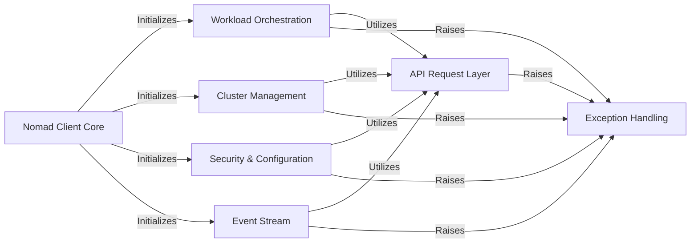

## Component Details

The `python-nomad` library provides a comprehensive Python client for interacting with the Nomad cluster. Its architecture is designed with a clear separation of concerns, where a central client core initializes and orchestrates various API-specific modules. All interactions with the Nomad API are channeled through a dedicated request layer, which handles the underlying HTTP communication and robust error management. This design ensures modularity, maintainability, and efficient interaction with the Nomad cluster's diverse functionalities, from workload orchestration to cluster management and security configurations.

### Nomad Client Core
The primary entry point for the python-nomad library, responsible for initializing the connection to the Nomad cluster and providing access to all other API-specific client modules. It acts as the central interface for users to interact with the Nomad cluster.

**Related Classes/Methods**:

- `nomad.Nomad:__init__` (30:60)
- `nomad.Nomad.get_uri` (62:65)

### API Request Layer
A foundational component that abstracts the complexities of making HTTP requests to the Nomad API. It handles URL construction, query parameter building, request execution, and robust error handling, serving as the underlying communication mechanism for all other API client modules.

**Related Classes/Methods**:

- <a href="https://github.com/jrxFive/python-nomad/blob/master/nomad/api/base.py#L17-L43" target="_blank" rel="noopener noreferrer">`nomad.api.base.Requester:__init__` (17:43)</a>
- <a href="https://github.com/jrxFive/python-nomad/blob/master/nomad/api/base.py#L103-L120" target="_blank" rel="noopener noreferrer">`nomad.api.base.Requester:request` (103:120)</a>
- <a href="https://github.com/jrxFive/python-nomad/blob/master/nomad/api/base.py#L122-L220" target="_blank" rel="noopener noreferrer">`nomad.api.base.Requester:_request` (122:220)</a>
- <a href="https://github.com/jrxFive/python-nomad/blob/master/nomad/api/base.py#L77-L84" target="_blank" rel="noopener noreferrer">`nomad.api.base.Requester._url_builder` (77:84)</a>

### Workload Orchestration
Manages the lifecycle of applications and services within Nomad, encompassing operations related to jobs (definition, registration, evaluation), deployments (tracking, promotion, failure), and allocations (listing, stopping, client-side file system interactions and statistics).

**Related Classes/Methods**:

- <a href="https://github.com/jrxFive/python-nomad/blob/master/nomad/api/job.py#L9-L363" target="_blank" rel="noopener noreferrer">`nomad.api.job.Job` (9:363)</a>
- <a href="https://github.com/jrxFive/python-nomad/blob/master/nomad/api/jobs.py#L9-L127" target="_blank" rel="noopener noreferrer">`nomad.api.jobs.Jobs` (9:127)</a>
- <a href="https://github.com/jrxFive/python-nomad/blob/master/nomad/api/deployment.py#L8-L172" target="_blank" rel="noopener noreferrer">`nomad.api.deployment.Deployment` (8:172)</a>
- <a href="https://github.com/jrxFive/python-nomad/blob/master/nomad/api/deployments.py#L8-L78" target="_blank" rel="noopener noreferrer">`nomad.api.deployments.Deployments` (8:78)</a>
- <a href="https://github.com/jrxFive/python-nomad/blob/master/nomad/api/allocation.py#L8-L73" target="_blank" rel="noopener noreferrer">`nomad.api.allocation.Allocation` (8:73)</a>
- <a href="https://github.com/jrxFive/python-nomad/blob/master/nomad/api/allocations.py#L8-L83" target="_blank" rel="noopener noreferrer">`nomad.api.allocations.Allocations` (8:83)</a>
- <a href="https://github.com/jrxFive/python-nomad/blob/master/nomad/api/client.py#L7-L32" target="_blank" rel="noopener noreferrer">`nomad.api.client.Client` (7:32)</a>
- <a href="https://github.com/jrxFive/python-nomad/blob/master/nomad/api/evaluation.py#L8-L74" target="_blank" rel="noopener noreferrer">`nomad.api.evaluation.Evaluation` (8:74)</a>
- <a href="https://github.com/jrxFive/python-nomad/blob/master/nomad/api/evaluations.py#L8-L75" target="_blank" rel="noopener noreferrer">`nomad.api.evaluations.Evaluations` (8:75)</a>

### Cluster Management
Provides functionalities for monitoring and controlling the Nomad cluster's infrastructure. This includes managing agents and nodes, retrieving cluster status and metrics, performing operator-level actions, and interacting with multi-region deployments.

**Related Classes/Methods**:

- <a href="https://github.com/jrxFive/python-nomad/blob/master/nomad/api/agent.py#L6-L98" target="_blank" rel="noopener noreferrer">`nomad.api.agent.Agent` (6:98)</a>
- <a href="https://github.com/jrxFive/python-nomad/blob/master/nomad/api/node.py#L9-L193" target="_blank" rel="noopener noreferrer">`nomad.api.node.Node` (9:193)</a>
- <a href="https://github.com/jrxFive/python-nomad/blob/master/nomad/api/nodes.py#L10-L95" target="_blank" rel="noopener noreferrer">`nomad.api.nodes.Nodes` (10:95)</a>
- <a href="https://github.com/jrxFive/python-nomad/blob/master/nomad/api/operator.py#L6-L64" target="_blank" rel="noopener noreferrer">`nomad.api.operator.Operator` (6:64)</a>
- <a href="https://github.com/jrxFive/python-nomad/blob/master/nomad/api/system.py#L6-L52" target="_blank" rel="noopener noreferrer">`nomad.api.system.System` (6:52)</a>
- <a href="https://github.com/jrxFive/python-nomad/blob/master/nomad/api/status.py#L8-L27" target="_blank" rel="noopener noreferrer">`nomad.api.status.Status` (8:27)</a>
- <a href="https://github.com/jrxFive/python-nomad/blob/master/nomad/api/metrics.py#L6-L42" target="_blank" rel="noopener noreferrer">`nomad.api.metrics.Metrics` (6:42)</a>
- <a href="https://github.com/jrxFive/python-nomad/blob/master/nomad/api/regions.py#L8-L68" target="_blank" rel="noopener noreferrer">`nomad.api.regions.Regions` (8:68)</a>

### Security & Configuration
Handles access control, organizational structures, and dynamic data within Nomad. This includes managing ACL tokens and policies, creating and managing namespaces, interacting with Nomad variables, and utilities for scaling policies, search, Sentinel policies, and job validation.

**Related Classes/Methods**:

- <a href="https://github.com/jrxFive/python-nomad/blob/master/nomad/api/acl.py#L6-L194" target="_blank" rel="noopener noreferrer">`nomad.api.acl.Acl` (6:194)</a>
- <a href="https://github.com/jrxFive/python-nomad/blob/master/nomad/api/namespace.py#L8-L107" target="_blank" rel="noopener noreferrer">`nomad.api.namespace.Namespace` (8:107)</a>
- <a href="https://github.com/jrxFive/python-nomad/blob/master/nomad/api/namespaces.py#L8-L75" target="_blank" rel="noopener noreferrer">`nomad.api.namespaces.Namespaces` (8:75)</a>
- <a href="https://github.com/jrxFive/python-nomad/blob/master/nomad/api/variable.py#L8-L111" target="_blank" rel="noopener noreferrer">`nomad.api.variable.Variable` (8:111)</a>
- <a href="https://github.com/jrxFive/python-nomad/blob/master/nomad/api/variables.py#L6-L66" target="_blank" rel="noopener noreferrer">`nomad.api.variables.Variables` (6:66)</a>
- <a href="https://github.com/jrxFive/python-nomad/blob/master/nomad/api/scaling.py#L8-L74" target="_blank" rel="noopener noreferrer">`nomad.api.scaling.Scaling` (8:74)</a>
- <a href="https://github.com/jrxFive/python-nomad/blob/master/nomad/api/search.py#L8-L98" target="_blank" rel="noopener noreferrer">`nomad.api.search.Search` (8:98)</a>
- <a href="https://github.com/jrxFive/python-nomad/blob/master/nomad/api/sentinel.py#L6-L98" target="_blank" rel="noopener noreferrer">`nomad.api.sentinel.Sentinel` (6:98)</a>
- <a href="https://github.com/jrxFive/python-nomad/blob/master/nomad/api/validate.py#L6-L44" target="_blank" rel="noopener noreferrer">`nomad.api.validate.Validate` (6:44)</a>

### Event Stream
Dedicated component for establishing and managing real-time event streams from the Nomad server, allowing for continuous monitoring of cluster activities and changes.

**Related Classes/Methods**:

- <a href="https://github.com/jrxFive/python-nomad/blob/master/nomad/api/event.py#L12-L27" target="_blank" rel="noopener noreferrer">`nomad.api.event.Event` (12:27)</a>
- <a href="https://github.com/jrxFive/python-nomad/blob/master/nomad/api/event.py#L31-L133" target="_blank" rel="noopener noreferrer">`nomad.api.event.stream` (31:133)</a>

### Exception Handling
A collection of custom exception classes designed to provide specific error information when interactions with the Nomad API fail, enabling more granular error management and debugging within the client library.

**Related Classes/Methods**:

- <a href="https://github.com/jrxFive/python-nomad/blob/master/nomad/api/exceptions.py#L6-L16" target="_blank" rel="noopener noreferrer">`nomad.api.exceptions.BaseNomadException` (6:16)</a>
- <a href="https://github.com/jrxFive/python-nomad/blob/master/nomad/api/exceptions.py#L35-L36" target="_blank" rel="noopener noreferrer">`nomad.api.exceptions.InvalidParameters` (35:36)</a>
- <a href="https://github.com/jrxFive/python-nomad/blob/master/nomad/api/exceptions.py#L27-L28" target="_blank" rel="noopener noreferrer">`nomad.api.exceptions.BadRequestNomadException` (27:28)</a>
- <a href="https://github.com/jrxFive/python-nomad/blob/master/nomad/api/exceptions.py#L23-L24" target="_blank" rel="noopener noreferrer">`nomad.api.exceptions.URLNotAuthorizedNomadException` (23:24)</a>
- <a href="https://github.com/jrxFive/python-nomad/blob/master/nomad/api/exceptions.py#L19-L20" target="_blank" rel="noopener noreferrer">`nomad.api.exceptions.URLNotFoundNomadException` (19:20)</a>
- <a href="https://github.com/jrxFive/python-nomad/blob/master/nomad/api/exceptions.py#L31-L32" target="_blank" rel="noopener noreferrer">`nomad.api.exceptions.VariableConflict` (31:32)</a>
- <a href="https://github.com/jrxFive/python-nomad/blob/master/nomad/api/exceptions.py#L39-L40" target="_blank" rel="noopener noreferrer">`nomad.api.exceptions.TimeoutNomadException` (39:40)</a>

### [FAQ](https://github.com/CodeBoarding/GeneratedOnBoardings/tree/main?tab=readme-ov-file#faq)